# Mini Render

**一个全新的、自绘的小程序渲染引擎 —— 不基于 WebView，也不依赖任何系统 UI 控件。**

用 Rust 从零实现：自己解析 WXML/WXSS、自己算布局、自己把每个像素画进帧缓冲，再配一个基于 QuickJS 的逻辑层（App / Page / Component / 模块系统 / Promise）。同时内置一个**编译器**，可把同一份小程序源码编译成其他端可直接运行的源码（当前已实现 HTML 目标）。

> 纯 Rust、无系统 UI 依赖；核心库可编译为 **Android / iOS / Windows / macOS / Linux** 原生库供各端集成。

---

## 🧠 渲染原理（这引擎和别的有什么不一样）

### 它不是什么

| 常见方案 | 做法 | 本引擎 |
|---------|------|--------|
| 微信小程序 WebView 渲染层 | WXML → DOM，交给浏览器内核排版绘制 | ❌ 不用 DOM、不用浏览器内核 |
| React Native / Weex | JS 描述 → 映射到系统原生控件（UIView / android.view） | ❌ 不映射系统控件 |
| Flutter | Dart + Skia 自绘 | ✅ 思路相近，但这里是 **Rust + 自研光栅器**，无 Skia 依赖 |
| Electron / Tauri WebView | 打包一个浏览器 | ❌ 不打包浏览器 |

整个渲染链路是自己的：**没有 WebView、没有 Skia、没有系统控件**，产物是一个纯 Rust 库（`cdylib` / `staticlib` / `rlib`），落地只需要一块可写的像素缓冲。

### 一帧是怎么画出来的

```text
WXML 源码 ──┐
            │  ① 解析：手写 WXML 解析器 → 节点树；WXSS 解析器 → 样式表
WXSS 源码 ──┤     （CSS 选择器引擎：标签/类/#id/*/属性/后代/子代 + 特异性排序）
            │
page.js ────┘  ② 逻辑层：QuickJS 执行 App/Page/Component，setData 产出数据快照
                  ↓
            ③ 模板求值：{{ }} 表达式引擎 + wx:if / wx:for 展开 → 渲染节点树
                  ↓
            ④ 样式计算：命中的 CSS + 内联 style 合成计算样式（含继承语义：
                         color / font-size / font-weight / line-height ...）
                  ↓
            ⑤ 布局：Taffy(Flexbox) 计算盒模型；文本节点挂 **自定义度量函数**，
                     由字体真实字形宽度决定 min-content / max-content 与换行行数
                  ↓
            ⑥ 绘制：自研 2D 光栅器逐层画进 Canvas（RGBA 像素缓冲）
                     · 路径填充：扫描线 + even-odd，4× 超采样抗锯齿
                     · 圆角：三次贝塞尔逼近四分之一圆（K=0.5523），按 min(w,h)/2 夹紧
                     · 文本：fontdue 光栅化字形 + 自建字形缓存 + 多字体回退
                     · 彩色 Emoji：自己读 Apple `sbix` 位图表取 PNG 字形（轮廓光栅
                       器画不出位图字体），按字号缓存后 blit，与文字同基线
                     · 图片：双线性采样、object-fit 等价的 5 种 mode、GIF 逐帧
                     · 其它：线性渐变、阴影、Alpha 混合、clip 裁剪栈
                  ↓
            ⑥' CSS 动画：`@keyframes` 在**绘制阶段**按全局时钟求值（transform /
                     opacity / 颜色只影响绘制，不触发重排 → 动画帧成本≈静态帧）；
                     `transform` 的缩放/旋转/倾斜把子树画到离屏画布再逆仿射采样贴回
                  ↓
            ⑦ 分层合成：正常流 → 宿主外壳(tabBar) → position:fixed 覆盖层
                         （保证全屏遮罩能压暗 tabBar，与浏览器层叠顺序一致）
                  ↓
            ⑧ 上屏：softbuffer 把像素缓冲贴到窗口；或 save_png 出图；或交给各端宿主
```

关键设计取舍：

- **文本度量驱动布局**：文本不是"估算宽度"，而是把 `TextMeasure` 上下文挂到 Taffy 叶子上，由真实字形度量参与布局。这样"定宽容器内按容器宽换行"和"收缩容器被内容撑开"两种 CSS 语义能同时成立。
- **行高对齐浏览器**：`line-height: normal` 按行内实际用字区分 —— 含 CJK 用 1.375、纯西文用 1.1777（对 headless Chrome 实测校准），避免逐行累积垂直漂移。
- **字体全进程共享**：系统字体解析一次约 0.9s，因此用 `OnceLock` 全局共享一份（只读 + 内部字形缓存自带锁），任何数量的渲染器实例创建成本都是常数级（实测 ~42ns）。
- **无 GC、无 DOM diff**：每帧从渲染节点树直接绘制，布局结果带缓存；重绘只做像素写入，不维护中间 DOM。
- **动画只重绘不重排**：CSS 动画求值放在绘制期而非布局期，代价是 `@keyframes` 里改 `width/height` 这类会引发重排的属性不生效（改 `transform`/`opacity`/颜色都生效）。
- **缺失的关键帧用元素自身的值补**：`@keyframes spin { to { transform: rotate(360deg) } }` 这种只写 `to` 的写法（最常见的转圈写法），缺的 `0%` 要取元素的计算值。少了这条，整个周期恒等于 360° —— 视觉上就是永远不转。
- **不给盒子留"保险余量"**：文本盒宽度就是字形度量之和（只向上取整到整像素），换行判定另留 0.5px 亚像素容差。曾经用"每个文本盒 +4px"防误换行，结果所有按内容定宽的元素（徽标/标签/胶囊）都比浏览器宽一圈。

### 帧成本是怎么压下来的

纯软件光栅意味着每一帧的每个像素都由 CPU 写出，所以性能全靠减少"无用像素写入"和"无用内存拷贝"。商城首页从 **49.6ms/帧** 压到 **6ms 级**（375×667 @2x，750×1334 物理像素），带全屏遮罩弹层的重状态下仍稳定 **~89 FPS**。

绘制侧：

| 优化 | 做法 | 为什么有效 |
|------|------|-----------|
| **矩形行填充** | `fill_rect` 先把裁剪矩形并入范围，不透明色直接 `pixels[start..end].fill(..)` 整行写；半透明色把 alpha 系数提到循环外只做整数乘加 | 原来逐像素 `set_pixel`，每个像素都重做越界检查 + 裁剪矩形的浮点截断。背景/卡片/全屏遮罩占满屏面积，这一步收益最大 |
| **视口裁剪** | `cull_outside_viewport` 横纵双向剔除屏幕外节点（余量 `VIEWPORT_CULL_MARGIN_PX`；带 transform/animation 的节点不剔） | 滚动页面里大部分节点在视口外，此前照样跑完整绘制流程 |
| **只清可见带** | 宿主用 `Canvas::clear_band` 只清「视口 ± 裁剪余量」 | 页面画布是整页高的（首页 750×6870），每帧全量 `clear` 相当于 20MB memset |
| **图片两级过滤** | 缩小时先按目标尺寸做一次面积（盒式）降采样并缓存（mip），逐帧只在这张小图上做双线性；再用 `draw_image_cached` 缓存最终缩放结果 | 纯双线性只看 4 个邻域，缩小超过 1 倍就漏采样，照片边缘明显锯齿。而面积滤波很贵：轮播平移时亚像素偏移每帧都变，不分两级的话按帧重算（实测 135 → 58 FPS） |
| **行级 blit** | 图片贴回走 `blend_row`，越界与裁剪按行判一次 | 大面积逐像素 blit 里，边界判断本身就是主要开销 |
| **绘制期浅拷贝** | `shallow_for_draw` 只复制节点自身样式/属性，不复制子树 | 原先绘制每个节点前 `node.clone()`，等于把整棵子树复制一遍 |

样式与数据侧（一次 `setData` 的重建成本 **32ms → 4ms**）：

| 优化 | 做法 | 为什么有效 |
|------|------|-----------|
| **选择器解析期编译** | `StyleRule` 持有编译好的复合选择器，匹配时直接用 | 匹配是「每个节点 × 每条规则」的二重循环，从前在里面现场分词解析选择器字符串 —— 一次全页重建十万次。建树+样式 **28.7ms → 2.9ms** |
| **setData 脏标记** | `__native_page_update` 是原生回调，只置一个 AtomicBool | 从前 JS 侧把整份 data `JSON.stringify` 塞进日志缓冲，没有任何消费方 —— 每次 setData 白付一次全量序列化 |
| **数据快照缓存** | 页面数据存 `Arc<Value>`，只在脏了才做一次 JS→Rust 的 JSON 往返 | 从前每帧都取一次整份页面数据 |
| **上屏零边界检查** | `present_to_buffer` 逐行用切片 `zip` 转换 | 整屏 100 万像素的索引访问，边界检查占比可观 |

配套改动：`load_image` 返回 `Arc<ImageData>` 且像素数据是 `Arc<Vec<u8>>`（GIF 每帧不再深拷贝整张 RGBA）；组件 id 与图片 cache key 去掉浮点格式化。

帧调度上，`RedrawRequested` 结束时若 `is_animating()` 就**睡到下一个刷新时点**再自续一次 `request_redraw()`：只靠事件循环的定时唤醒每周期要多绕一圈（144Hz 屏上只有 ~47FPS），完全不限速又会以 2~4 倍刷新率空转烧核。时点必须从**帧开始**算 —— 从 present 之后算会多出一整个渲染耗时（16.7ms 的节拍变成 21ms，只剩 46FPS）。空闲时回到 `Wait` 休眠。

逻辑层的 `setData` 必须能自己触发重绘：定时器/网络回调改数据时页面上可能一个 CSS 动画都没有，没有脏标记的话秒杀倒计时会一直显示旧值。

```bash
# 逐秒帧率与帧内分段：「N 帧/秒，最慢一帧 X ms（逻辑 / 渲染[页面 覆盖层 tabBar] / 上屏）」
# 并附一行「整帧归因」：这一秒里整屏重绘各是被什么触发的（需重绘 / swiper / scroll-view / 动画）
MINI_FPS=1 cargo run --release --bin mini-app-window -- sample-app
# 布局重建分段：「模板求值 / 建树+样式 / 布局 / 换行修正」；并打印每次 setData 的失效范围
MINI_LAYOUT_LOG=1 cargo run --release --bin mini-app-window -- sample-app
# 滚动诊断：内容高 / 视口 / 画布高 / 当前位置与上限
MINI_SCROLL_LOG=1 cargo run --release --bin mini-app-window -- sample-app
# 关掉 setData 的增量失效（一律整帧）：用于逐像素对照验证，见 tools/damage-check.sh
MINI_NO_DAMAGE=1 cargo run --release --bin mini-app-window -- sample-app
```

> 「整帧归因」这一行是为了让性能问题能收敛：**「为什么这一帧又整屏重画了」如果只能靠猜就永远查不完**。它直接指出了首页每秒一顿的元凶是倒计时的 `setData`（每秒 1 次整帧），而不是当时以为的滚动或动画。

各页单帧耗时（优化前 → 后）：

| 页面 | 前 | 后 |
|------|----|----|
| `sample-app` 首页（轮播 + 倒计时 + 骨架动画） | 49.6ms | **6.1ms** |
| `sample-app` 组件页 | 8.6ms | **1.0ms** |
| `sample-app` 能力展示页 | 10.3ms | **2.2ms** |
| `sample-app` 购物车 | 2.0ms | **0.5ms** |
| `news-app` 首页 | 24.3ms | **~11ms** |
| `news-app` 详情 | 13.0ms | **~5ms** |

帧节奏与局部重绘（这两条决定「高刷有没有被用上」）：

| 优化 | 做法 | 为什么有效 |
|------|------|-----------|
| **动画帧只重绘损伤区** | 只有 CSS/JS 动画要重绘时，取动画元素包围盒的并集做裁剪矩形，只清、只画这一小块 | 一个 `animation: pulse infinite` 的小徽标，从前逼着整屏每帧重新光栅化（首页 8~14ms/帧）。浏览器靠图层合成避免这件事，这里用裁剪矩形达到同样效果 |
| **滚动不重绘** | 页面画布用内容坐标，只要视口还落在「已绘制条带」内，滚动只是取不同切片上屏 | 滚动期间大部分帧只花上屏的 3~4ms |
| **裁剪余量自适应** | 滚动时余量留 400 物理 px（少触发重绘），静止时收到 48（偶发整帧重绘只画可见区，帧尖峰更低） | 两种场景要的是相反的东西 |
| **覆盖层按需重绘** | `position:fixed` 层钉在视口上，滚动不影响它；只在数据/按压态/换页时重画 | 一次全屏遮罩的重绘是 4ms |
| **swiper 只在换页时出帧** | 换页做 0.3s 滑动过渡（与微信一致），其余时间不要求出帧 | 从前「有多于一项就每帧重绘」，而 swiper 平时根本不动 |
| **固定节拍限速** | 下一帧时点是「上一时点 + 一个刷新周期」的累加，睡到差 0.9ms 再自旋对齐 | 从「本帧开始 + 周期」算的话，每帧都把 sleep 的过冲算进新起点，节拍越走越偏。平均帧率看着达标、实际帧间隔在抖，正是「高刷没体现出来」的手感 |

`MINI_FPS=1` 会打印帧间隔区间，这个数比平均帧率更能说明手感：优化后商城首页稳定在 **6.7~7.2ms**（144Hz 的节拍是 6.94ms），此前是 **6.9~25ms**。

> 已知还没做完的一条：`setData` 会让整棵渲染树重建 + 整条带重绘（首页秒杀倒计时每秒一次，约 18ms 的单帧尖峰 = 掉一帧）。彻底解决要做增量失效 —— 对比新旧渲染树，只重画真正变了的节点。目前只做到了「动画帧」的损伤区重绘，数据变化仍走整帧。

> 明确没做的事：不引入 GPU（项目定位就是"给我一块像素缓冲我就能画"），不做元素级位图缓存（与动画/裁剪栈交互复杂）。抗锯齿也**没有**换成子采样：圆和圆角的覆盖率用的是有符号距离的线性斜坡，对曲率半径远大于像素的边界，面积占比在法线方向本来就是线性的 —— 换成 4×4 子采样反而量化成 1/16 档，实测与 Chrome 的差异从 4.7% 涨到 5.3%。

### 滚动手感是按 iOS/微信那套做的

滚动不是"位置加减再夹到边界"：

- **越界走橡皮筋**：超出边界的位移按 `1 - 1/(x·0.55/d + 1)` 衰减（`d` 取真实视口尺寸，页面内的小 `scroll-view` 用自己的高度而不是整屏高）。
- **手势结束回弹**：触控板给 `TouchPhase::Ended`（winit 把 macOS 的动量阶段也映射进来），据此立刻回弹；鼠标滚轮没有抬手事件，由控制器的静默计时兜底。
- **拖拽与滚轮同一套语义**：滚轮/触控板维护一个"未夹紧"的累计位置，再经同一个橡皮筋映射成显示位置，所以两种输入的手感一致。
- **内容变短要收回位置**：换页或列表收起后如果位置还停在原处，会停在画布之外的空白上，而且因为"不越界"永远不会触发回弹。

窗体在拿到第一帧的真实内容高之前，滚动上限是 0（不是某个写死的常数）—— 否则内容不足一屏的页面在首帧前就能被拉出几百像素空白。

**按压反馈**支持两种写法，两者共用同一条代码路径：CSS 的 `:active`，和小程序的 `hover-class`。建树期就把「按压态整套样式」算好（把目标元素标记为 pressed 并补上 hover-class 的类名，重新取一次 CSS 声明），绘制期按需切换；声明了 `transition` 就在常态与按压态之间按缓动插值。代价是按压只影响绘制类属性（背景/颜色/透明度/transform）—— 按一下就重排整页在纯软件光栅上太贵。

> 这里原来有个隐蔽的坑：未知伪类一律「宽松放行」，于是 `.btn:active{background:orange}` **永远生效**，元素看起来一直是按下态。`:hover` / `:focus` 在触屏语义下不成立，现在一律不匹配。

**JS 操作样式**走微信的正式 API：`wx.createAnimation()` 链式累积一步的目标值，`step()` 定格，`export()` 交给 `animation="{{animData}}"`。渲染层按 actions 顺序插值（translate / rotate / scale / skew / opacity / backgroundColor），起始时刻按载荷指纹记忆 —— 同一份 export 继续播，换了新的就重新开始。编译出的 H5 有一份同语义实现（映射成 CSS transition），两端行为一致。`width`/`height` 会引发重排，与 CSS 动画同样的取舍：不支持。

**下拉刷新**按微信的语义分成两件事：回弹一直有，指示器与回调由页面 json 的 `enablePullDownRefresh` 决定（缺省继承 `app.json` 的 `window`）。下拉不到 64px 只回弹；到位松手才进入刷新态 —— 内容被按住在露出指示器的位置（等价 iOS 的 `contentInset.top`），三点指示器循环呼吸，直到逻辑层调用 `wx.stopPullDownRefresh()` 才收回归位。`wx.startPullDownRefresh()` 可以从逻辑层主动进入。原生端与编译出的 H5 用同一套阈值、同一条橡皮筋公式、同样的三点外观。

### 弹窗不穿透

`position: fixed` 层画在页面之上，坐标是视口坐标（不含滚动偏移），所以命中判定必须**先只在覆盖层里找，命中就到此为止**：

- 事件绑定带 `is_fixed` 标记，命中冒泡可以只在覆盖层或只在正常流里做。从前是「拿全局命中结果，再用包围盒是否落在视口内来猜它是不是 fixed」—— 页面顶部的普通元素同样满足这个条件，于是弹窗弹着也能点到底下的商品。
- 覆盖层各子树根的视口包围盒被记下来：**落在里面的点击一律由覆盖层消费**，即使那一点没有任何处理器（典型就是只写了半透明遮罩）。
- 按压态、拖动、滚轮同样被拦住：弹窗弹着的时候页面不该滚动，下层的输入框也不该获得焦点。
- 覆盖层在「内容没变」的帧里跳过重绘（性能优化），但事件绑定每帧清空重建 —— 跳过的帧要把上一次的绑定与遮挡区域补回来，否则那些帧里点击照样穿透。

> 这里还连带修掉一个更隐蔽的问题：带 `scale`/`rotate` 的容器走离屏合成路径，而那条路径**直接把子树的事件绑定丢掉了**（原注释写作「已知限制」）。弹窗普遍用 `animation: popIn`（含 scale）做入场，结果弹窗里的关闭按钮、领取按钮全是死的，点击还会穿到下层。现在改为在离屏那趟之后，按**未变换**的真实几何重新注册一遍绑定 —— 对「围绕中心缩放/旋转」这类实际用法足够接近。

`--click <x,y>` 可以脚本化验证这套语义：它走的是与交互窗体完全相同的命中/冒泡/导航链路。

```bash
# 弹窗弹着点弹窗外的遮罩 -> onCloseCoupon；点弹窗内部 -> onNoop（不导航）；
# 点弹窗里的按钮 -> onClaimCoupons；关掉弹窗再点页面 -> 正常导航
cargo run --release --bin mini-app-window -- sample-app --snapshot target/t \
    --route pages/index/index --settle 1 --click 180,300
```

> 有一条不变量必须守住：**上屏用的滚动偏移，必须等于画布上那条带被绘制时的偏移**。页面画布只画「视口 ± 裁剪余量」，偏移变了却没重画，上屏就会取到没画过的区域 —— 表现为滑动时一片空白、停下来内容才出现。所以帧循环里按位置比对来决定重绘，而不是依赖每条输入路径都记得置脏标记（漏一处就会露白）。

### setData 只重绘变化的那一块

`setData` 曾经一律整帧重绘。首页那种长页面一帧要 13~18ms，而秒杀倒计时每秒 setData 一次 —— 于是稳定的 145FPS 里每秒插进一个长帧，丢掉两三帧。平均帧率看着很高，手上就是**每秒一顿**。

现在布局重建之后会把新旧两棵 `RenderNode` 树连同各自的 taffy 布局并行走一遍，只收集「文本/属性变了」或「几何变了」的节点包围盒（几何变化要同时算上旧位置和新位置，否则旧像素擦不掉），并据此裁剪这一帧的清屏与绘制。倒计时那一下的失效范围是 **45×33 像素**，而不是整屏。覆盖层同理：变化不在 `position:fixed` 子树里，就直接复用上一张覆盖层画布（首页那个弹窗从前要陪着每秒重画一次，白付 4ms）。

判断依据只看 `text` 与 `attrs`：样式是由标签 + class/style 属性 + 祖先链 + 兄弟序号推导出来的，而结构相等已经由这趟并行遍历本身保证。**一切拿不准的情况都退回整帧**：结构变了、跑到 `scroll-view`/`swiper`/带 transform 的子树里（那些子树的绘制坐标不等于布局坐标）、影响面超过视口三分之一。少画一块留下脏像素，比多画一次严重得多，所以偏置是刻意保守的。

这条优化必须配一道逐像素对照校验，否则「少画了一块」这种 bug 只会以偶发脏像素的形式出现：

```bash
# 同一次 setData 分别走增量路径与强制整帧路径（MINI_NO_DAMAGE=1），截图必须逐字节一致
bash tools/damage-check.sh
```

> 这道校验第一次跑起来是**空转**的：`--eval` 原本在首帧之前执行，于是两边都走整帧路径，全绿但什么也没测到。现在注入前会先出一帧 —— 真机上 `setData` 永远发生在已渲染的页面上。诊断开关 `MINI_LAYOUT_LOG=1` 会打印每次 setData 的失效范围，以及退回整帧时的具体原因，用来确认校验没有再次变成空转。

> 连带修掉一个隐蔽的耦合：局部重绘帧只访问了裁剪范围内的节点，收集到的「动画元素包围盒」是不完整的。拿它覆盖旧记录，下一个动画帧的损伤区就只剩这一小块，范围外的动画会**就此冻住**。现在只有「裁剪范围覆盖了全部动画元素」的帧（整帧、或损伤区本就由动画包围盒算出来的帧）才更新这份记录。

> 反过来，**页面滚动本身不该触发重绘**。页面画布是整页高的、用内容坐标，滚动只是让上屏按新偏移取不同的切片（上屏每帧都做）。所以「正在滚动」不进重绘闸门 —— 只有滚出已绘制条带那一刻才补画一次。曾经把「正在滚动/惯性中」也算进闸门，于是滚动的每一帧都整条带重画（约 6~7ms），刚好卡在 144Hz 的 6.9ms 预算边缘，偶尔超一点就丢帧 —— 这正是「滑动像抖动、高刷没体现出来」的根因。改掉之后滚动的绝大多数帧只花上屏的拷贝时间（约 2~3ms），只有跨条带的那一帧才有一次整页重绘的尖峰。`scroll-view` 内滚动仍要重绘（它的内容按自身偏移画进整页画布，没有独立切片）。

### picker 选择器

`<picker>` 不是页面里的一段 DOM，而是宿主弹出的底部浮层（和微信一致）：点一下弹出、选好按「确定」才回调 `bindchange`，点「取消」或遮罩直接关。渲染层只负责把「这里有个 picker、它有哪些选项、当前选到第几个、变更回调叫什么」登记下来（`bindchange` 本身不是可命中事件，靠事件绑定表找不到它），面板的状态机 / 绘制 / 命中在宿主侧。

五种 mode 都支持：`selector`（单列下标）、`multiSelector`（多列下标数组）、`time`（时/分）、`date`（年/月/日，`fields` 控制到哪一级、`start`/`end` 限定年份、换月自动重算天数含闰年）、`region`（省/市/区联动，内置一份行政区划表）。面板入场/退场是 ease-out 位移动画，滚轮离中心越远越淡。编译出的 H5 有一份同构实现（底部面板 + scroll-snap 滚轮），`detail.value` 的格式与原生端逐一对齐。

### 双端一致性是被量化验证的

引擎自带对比工具：同一份小程序源码，一边走原生渲染出 PNG，一边编译成 HTML 用 Chrome 截图，逐像素比对并产出报告。

```bash
cargo run --example compare -- --all --out target/render-compare
# 输出 rust.png / html.png / side-by-side.png / diff.png + report.json（变化像素比、MAE、RMSE）
```

更进一步，**被对比的可以是窗体宿主真实出的那一帧**：窗体带无头快照模式，走与交互运行完全相同的管线（页面加载、`app.wxss` 合并、自定义 tabBar、fixed 覆盖层、Toast/Modal、像素合成顺序）输出整帧 PNG，再交给对比工具。这样报告衡量的是「用户真正看到的画面 vs H5」，而不是示例里另写一份渲染。

```bash
# 整帧快照：可指定动画时刻 / 真实等待 / 滚动位置 / 注入交互后的状态
cargo run --release --bin mini-app-window -- sample-app --snapshot target/window-snap
cargo run --release --bin mini-app-window -- sample-app --snapshot target/s \
    --route pages/components/components --scroll 760 --time 0.45
cargo run --release --bin mini-app-window -- sample-app --snapshot target/s \
    --route pages/category/category --eval "__currentPage.onPlus({currentTarget:{dataset:{id:101}}})"

# 让窗体的帧参与逐像素对比
cargo run --release --example compare -- --all --rust-from target/window-snap --out target/window-compare
```

`--time` 与 `--settle` 是两件事，别混用：

- `--time <秒>`：把 CSS 动画时钟拨到某个时刻求值，**不消耗真实时间**。双端对比走这条 —— H5 侧为了截图确定性刻意禁用了页面脚本，那边的 JS 状态也不会往前跑。
- `--settle <秒>`：真实等待，让 `setInterval`/`setTimeout`、延时弹层、轮播自动播放跑起来。要「和真机一样」的画面时用它。`--eval` 在 `--settle` 之后执行，所以脚本里"关掉优惠券弹层"这种操作不会被随后的 setTimeout 又打开。
- `--frames <N>`：按刷新率跑 N 个**与交互窗体同一套闸门/损伤区逻辑**的帧再截图。局部重绘这类只在连续出帧时才暴露的问题（某个动画元素被漏出损伤区而静止），单帧快照永远走整帧重绘，测不出来。

```bash
# 真实运行 4 秒后截图：新人券已弹出、秒杀倒计时已走到 01:59:56
cargo run --release --bin mini-app-window -- sample-app --snapshot target/real \
    --route pages/index/index --settle 4 --time 4
```

含 `<canvas>` 的页面是个例外：canvas 的画面只能由 JS 画出来，静态 HTML 里是一块空白，所以对比工具对这类页面保留脚本 —— 否则等于拿"空画布"当参考基准，原生端画对了反而会让差异变大。

当前实测（375×667 @2x，窗体整帧 vs Chrome）：`sample-app` 15 页整体差异 **4.66%**（单页 1.5%~8.0%），`news-app` 6 页 **6.47%**，剩余差异集中在粗体字形与亚像素文本位置。

### 编译器：同一份源码，编译出别端源码

除了原生渲染，引擎还包含一个多目标编译器（`src/compiler/`）。它复用同一套解析器与数据快照，把小程序编译成**目标端的源码工程**，而不是套壳运行：

```bash
cargo run --bin mini-compiler                      # sample-app → dist-html/
cargo run --bin mini-compiler news-app dist-news html
```

HTML 目标产出结构化工程（`common/base.css` + 每页 html/css/js + 运行时），支持事件、`setData` 响应式重渲染、`model:` 双向绑定、`wx.*` 跳转、自定义 tabBar 切换。新增目标端只需实现 `CompileTarget` trait 并在 CLI 注册。

---

## 目录

- [渲染原理](#-渲染原理这引擎和别的有什么不一样)
- [特性总览](#-特性总览)
- [快速开始](#-快速开始)
- [浏览器调试预览](#-浏览器调试预览)
- [场景画廊](#-场景画廊64-个真实渲染)
- [视频与 Canvas](#-视频与-canvas)
- [支持的组件](#-支持的组件)
- [CSS 支持](#-css-支持)
- [小程序生命周期](#-小程序生命周期)
- [架构](#-架构)
- [素材图片生成](#-素材图片生成)
- [多平台 SDK 编译](#-多平台-sdk-编译)
- [使用示例](#-使用示例)
- [测试](#-测试)
- [项目结构](#-项目结构)

---

## ✨ 特性总览

| 能力 | 说明 |
|------|------|
| 🎨 **2D 渲染引擎** | 纯 Rust；抗锯齿描边/圆角/图片、Alpha 混合、阴影、渐变、双线性采样 |
| 📐 **Flexbox 布局** | 基于 [Taffy]；含文本按容器宽度自动换行的二次布局修正 |
| 🧩 **30+ 组件** | view/text/image/button/input/scroll-view/swiper/**canvas**/**video** 等 |
| ⚡ **QuickJS 运行时** | 完整 JS，App/Page/Component、Behavior、CommonJS 模块、Promise 微任务 |
| 🎯 **CSS 选择器引擎** | 标签/类/`#id`/`*`/属性/组合器/特异性/`@import`/`var()`/`calc()` |
| 📄 **WXML 模板** | `wx:if/elif/else`、`wx:for`、`<block>`、真正的 `{{ }}` 表达式 |
| ♻️ **完整生命周期** | App / Page / Component 三级钩子 + 组件 `pageLifetimes` 联动 |
| 🎬 **视频播放** | 手写 MP4 解复用 + openh264 解码 + rodio 音频（桌面端 macOS 音频接口） |
| 🖌️ **Canvas 2D** | `wx.createCanvasContext` 全套 API：路径/圆弧/文本/图片/渐变/变换 |
| 👆 **事件系统** | `bindtap` 冒泡、`catchtap` 阻止冒泡、`dataset`、输入事件 |
| 🖱️ **交互** | 滚动惯性/回弹、输入框、勾选/单选/开关/滑块 |
| 🌐 **浏览器调试** | 内置 HTTP 服务，浏览器打开链接即可实时操作 UI |
| ⏱️ **高刷适配** | 事件循环按显示器刷新率出帧（60/120/144Hz），空闲零占用 |
| 🔗 **多端集成** | C FFI（`mr_*`），可编译为 5 大平台原生库 |

---

## 🚀 快速开始

```bash
# 1) 安装 Rust（若未安装）
curl --proto '=https' --tlsv1.2 -sSf https://sh.rustup.rs | sh
source "$HOME/.cargo/env"

# 2) 构建
cargo build --release

# 3) 运行示例
cargo run --example gallery         # 渲染全部 64 个场景到 doc/gallery/
cargo run --bin mini-devserver      # 浏览器调试预览（见下节）
cargo run --example video_player    # 独立视频播放窗口（自动循环 + 声音）
cargo run --bin mini-app-window     # 窗口应用（加载 sample-app）
cargo run --bin mini-launcher       # 小程序启动器（扫描 sample 目录）

# 4) 测试（223 个用例）
cargo test
```

---

## 🔄 编译为 HTML 工程（transpile）

因为 WXSS 基本是标准 CSS、WXML 与 HTML 结构一一对应，引擎内置**源码编译器**，把小程序
编译成浏览器可原生渲染的 HTML + CSS（`src/transpile.rs`）：

- WXML(+data) → HTML（`wx:for/wx:if/{{}}` 展开 + 标签映射；`bindtap`→`data-tap`、`data-*`→`data-ds-*`）
- WXSS → CSS（`rpx`→`px`，1rpx=0.5px @375；其余样式浏览器直接识别）

```bash
cargo run --bin mini-compiler                    # sample-app -> dist-html/（静态 HTML 工程）
cargo run --bin mini-compiler <小程序根> <输出目录>
# 打开 dist-html/index.html 查看每个页面编译出的独立 HTML
```

> 这既是「一套源码、两套 UI」（Rust canvas 渲染 + 浏览器 HTML 渲染）的基础，也是后续
> 「编译到 Android / iOS 原生源码」的中间层。

## 🌐 浏览器调试预览（HTML 直渲染，极速）

无需模拟器，在**浏览器里直接操作小程序 UI**：内置 HTTP 服务把页面编译成 HTML/CSS 交给
浏览器**原生渲染**（不再逐帧渲染图片），点击即时命中事件、`setData`/页面跳转后返回新的
HTML 片段做局部替换——单次交互 ~3ms，真实 DOM 可交互。

```bash
cargo run --bin mini-devserver                    # 默认加载 sample-app（首页）
cargo run --bin mini-devserver <小程序根> [端口]   # 端口被占用会自动顺延
```

启动后打开终端输出的 `http://127.0.0.1:9000`。仅使用 Rust 标准库网络，无额外依赖。

| 路由 | 作用 |
|------|------|
| `GET /` | 编译好的整页 HTML（base.css + 页面 CSS + body + 运行时） |
| `POST /event` | 命中事件 → 调用页面方法/`setData`/导航 → 返回新 HTML 片段 |
| `POST /back` | 返回上一页 |

---

## 📱 两个可用的示例小程序

仓库里的 `sample-app`（商城）与 `news-app`（头条新闻）不是静态样板，而是**功能闭环**的小程序，原生窗体与编译出的 H5 行为一致：

| | `sample-app` 商城（15 页） | `news-app` 新闻（6 页） |
|---|---|---|
| 首页 | 自动轮播 banner、金刚区、**进页即弹新人优惠券**（缩放入场动画）、限时秒杀真实倒计时、触底加载、下拉刷新 | 要闻轮播、频道横滑切换、下拉刷新、触底加载、卡片收藏 |
| 详情 | 图片轮播、规格半屏弹层、加购 / 立即购买、rich-text 图文、评价 | 正文字号设置**即时生效**、评论发布、点赞 / 收藏 / 关注持久化、相关阅读 |
| 交易 · 互动 | 购物车（storage 持久化）→ 确认订单（地址 / 配送 picker / 优惠券 / 支付方式 / 备注）→ 提交下单 → 订单列表 + 物流时间轴 + 确认收货；搜索页含历史与热搜 | 搜索（历史 + 热搜榜 + 排序）、热榜 + 签到日历 + Canvas 阅读统计 |
| 能力总览 | `pages/showcase`：CSS 动画、transform、彩色 emoji、竖向轮播、GIF、表单控件全家桶、进度 / 评分 / 徽标、rich-text、Canvas 图表、Toast / Loading / Modal / 操作面板 | 视频页可真实播放 `<video>`，自动播放开关持久化 |
| 返回上一页 | 二级页自绘返回栏（`wx.navigateBack`）；逻辑层页面栈复用实例，返回不会重跑 `onLoad` | 同上 |

跨页数据（购物车、订单、收藏、设置、搜索历史）统一走 `wx.storage`，所以编译成 H5 后即使每个页面是独立文档也不丢状态。

```bash
cargo run --release --bin mini-app-window -- sample-app   # 商城
cargo run --release --bin mini-app-window -- news-app     # 新闻
```

多步交互也能脚本化验证（每段 `--eval` 之后宿主会把导航跑完）：

```bash
cargo run --release --bin mini-app-window -- sample-app --snapshot target/flow \
    --route pages/detail/detail --eval "__currentPage.onBuyNow()"          # 进入确认订单页
cargo run --release --bin mini-app-window -- news-app --snapshot target/nav \
    --route pages/home/home \
    --eval "__currentPage.onOpenArticle({currentTarget:{dataset:{id:301}}})" \
    --eval "wx.navigateBack()"                                            # 进详情再返回
```

---

## 🖼️ 场景画廊（64 个真实渲染）

以下页面均由本引擎真实渲染输出（纯 WXML + WXSS + 数据），一键生成：

```bash
python3 scripts/gen_assets.py   # 首次：生成真实商品图/头像/图标素材
cargo run --example gallery     # 渲染 64 个场景到 doc/gallery/
```

### 电商 · 社交 · 导航

| | | |
|:---:|:---:|:---:|
| <br/>**登录页** | <br/>**商品列表** | <br/>**商品详情** |
| <br/>**购物车** | <br/>**个人中心** | <br/>**设置页** |
| <br/>**聊天对话** | <br/>**动态流** | <br/>**宫格导航** |

### 表单 · 数据 · 生活

| | | |
|:---:|:---:|:---:|
| <br/>**表单填写** | <br/>**数据看板** | <br/>**图片画廊** |
| <br/>**天气** | <br/>**订单列表** | <br/>**商城首页** |
| <br/>**通讯录** | <br/>**音乐播放器** | <br/>**标签与徽章** |

### 弹窗 · 滑动 · 交互

| | | |
|:---:|:---:|:---:|
| <br/>**确认弹窗** | <br/>**操作面板** | <br/>**Toast 提示** |
| <br/>**Swiper 轮播** | <br/>**左右滑动** | <br/>**上下滑动** |
| <br/>**底部选择器** | <br/>**日历** | <br/>**评分与物流** |

### 电商大促 · 组件补充

| | | |
|:---:|:---:|:---:|
| <br/>**电商首页**（轮播/秒杀/瀑布流） | 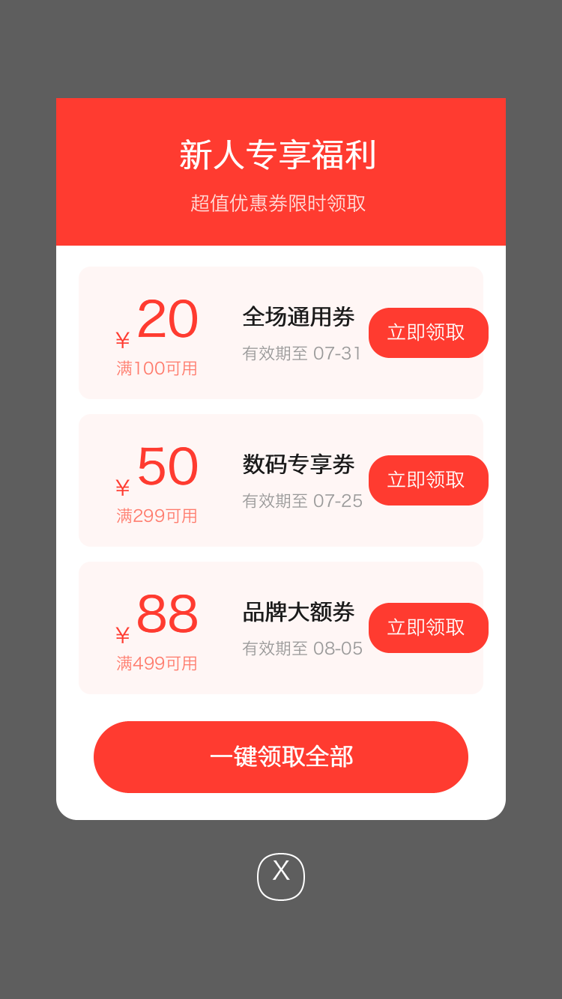<br/>**优惠券弹窗** | 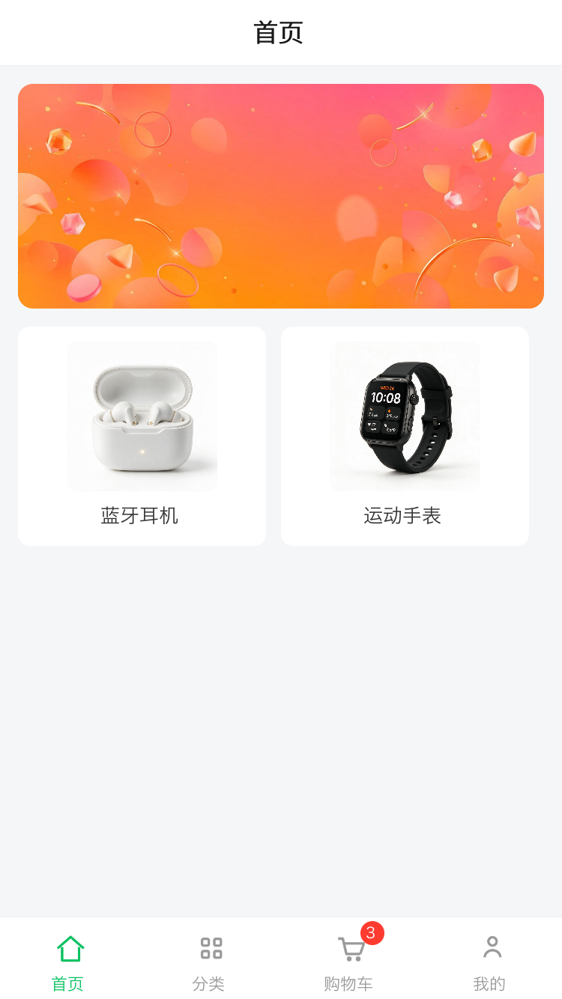<br/>**底部 TabBar** |
| 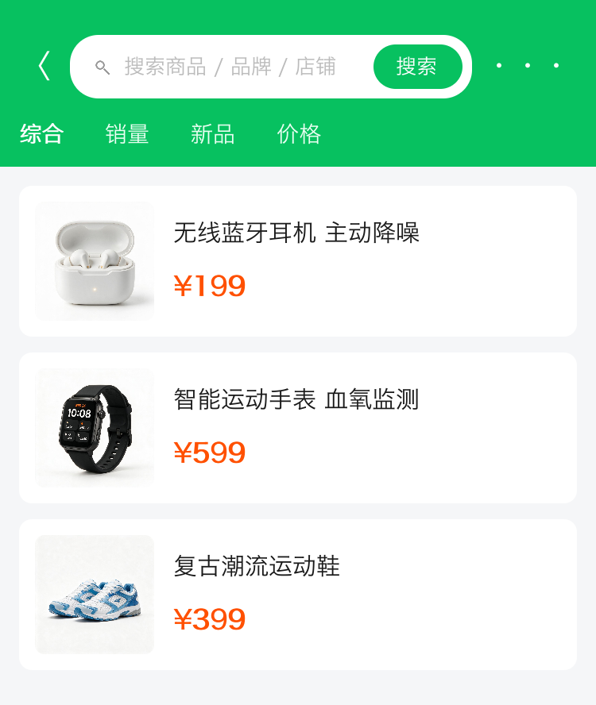<br/>**自定义搜索栏** | 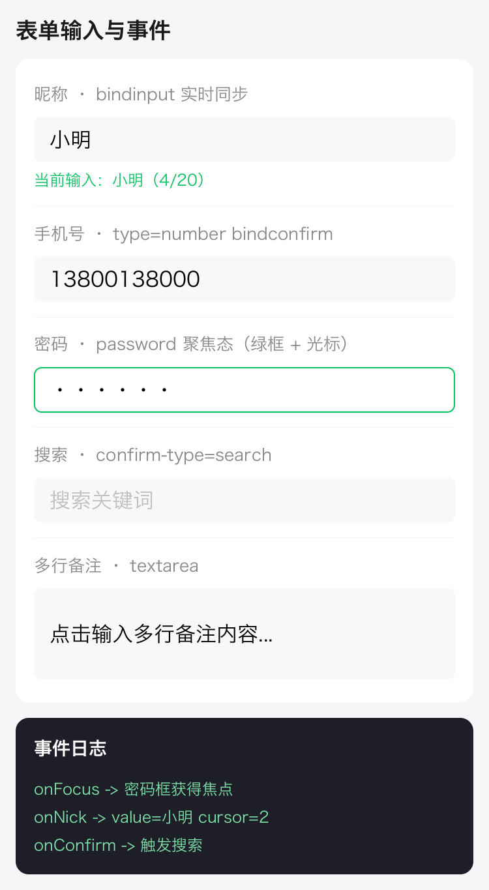<br/>**输入与事件** | 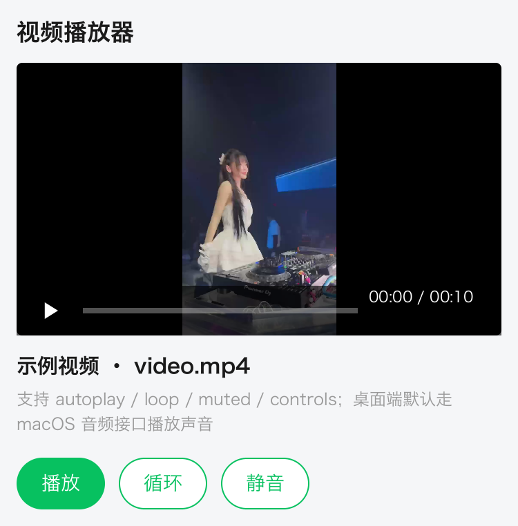<br/>**视频播放器** |
| 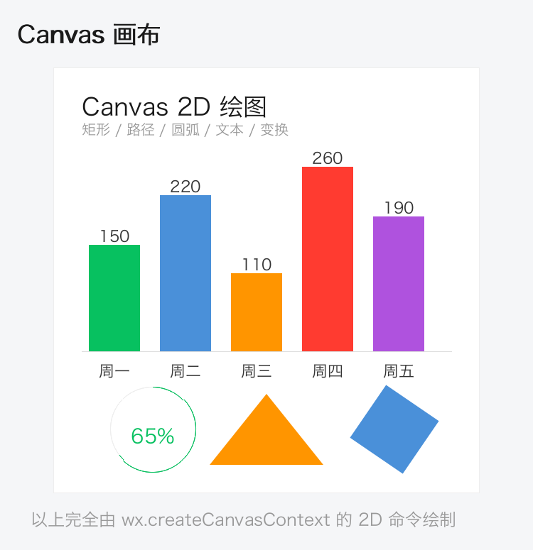<br/>**Canvas 2D 绘图** | 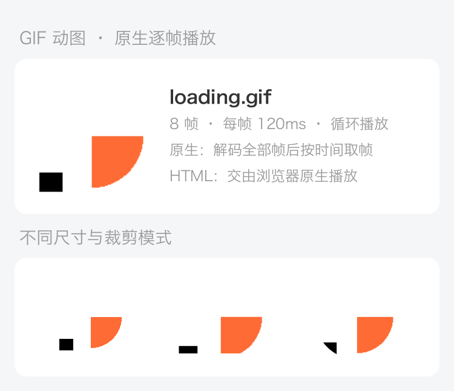<br/>**GIF 动图**（逐帧播放） | |

### 资讯类（与 `news-app` 示例同款设计）

| | | |
|:---:|:---:|:---:|
| <br/>**新闻信息流**（频道横滑/热榜） | <br/>**文章详情**（长文/评论） | 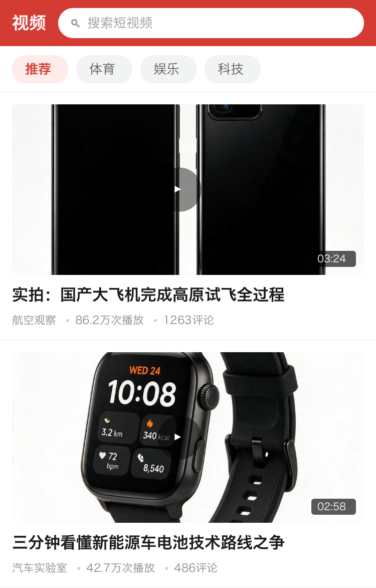<br/>**视频频道** |
| 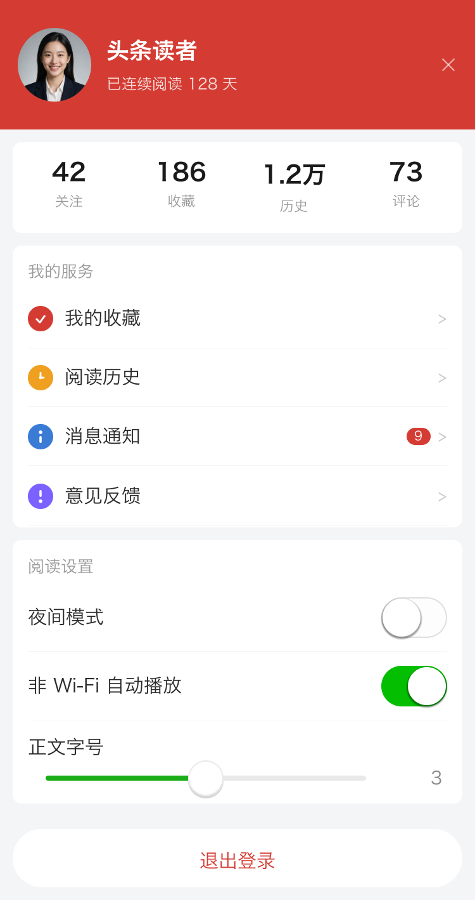<br/>**我的**（开关/滑块设置） | | |

### 更多商业场景

| | | |
|:---:|:---:|:---:|
| <br/>**物流跟踪**（时间轴） | <br/>**直播带货** | <br/>**外卖点餐**（左右分栏） |
| 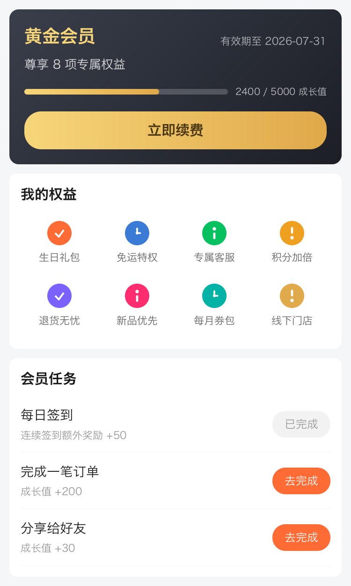<br/>**会员中心** | <br/>**支付收银台** | <br/>**评价晒单** |
| <br/>**搜索结果** | <br/>**消息中心** | <br/>**签到打卡** |
| 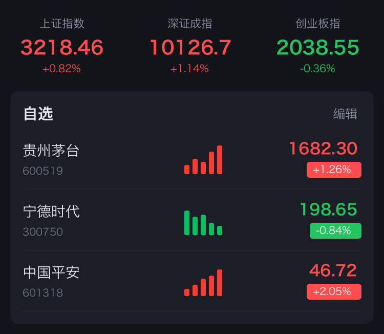<br/>**行情看板** | <br/>**酒店预订** | 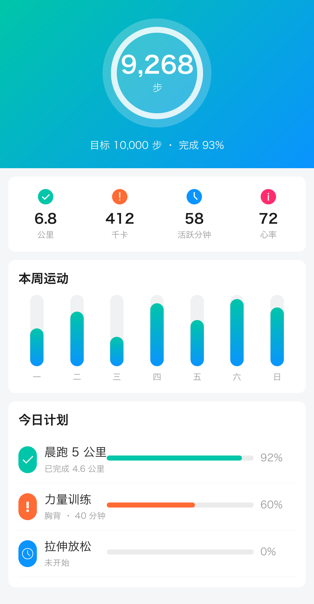<br/>**运动健康** |

### CSS 动画 · 变换 · 控件度量

`58_css_anim_frame1~4` 是同一份 WXML/WXSS 在 `t = 0 / 0.3 / 0.6 / 0.9s` 的四张快照 —— 固定动画时钟就能把 `@keyframes` 的任意一帧稳定截出来，因此动画也能进回归对比。

| | | |
|:---:|:---:|:---:|
| 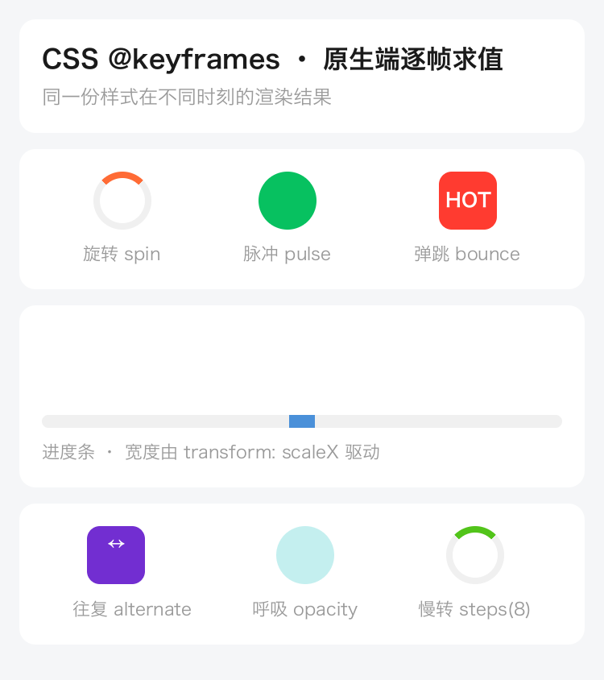<br/>**CSS 动画 t=0s** | 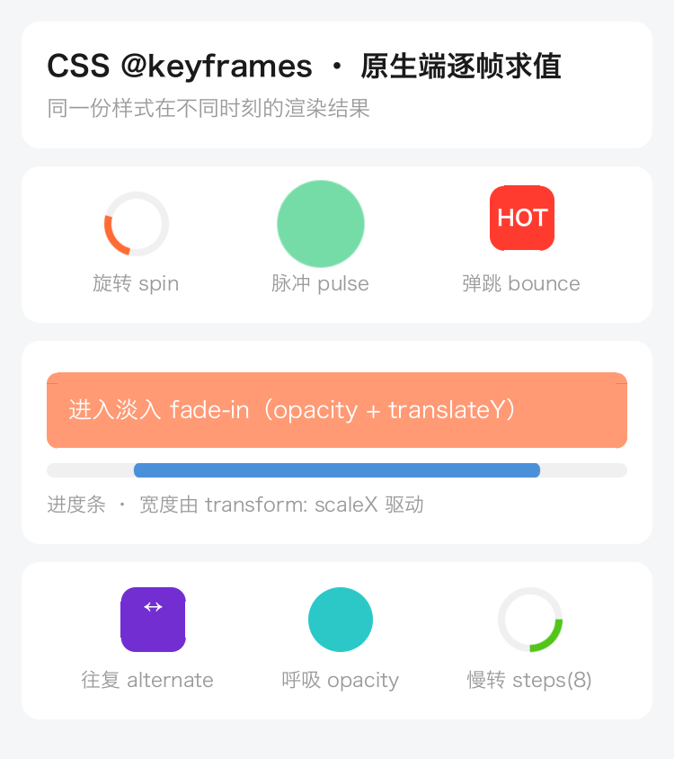<br/>**CSS 动画 t=0.6s**（旋转/脉冲/弹跳） | 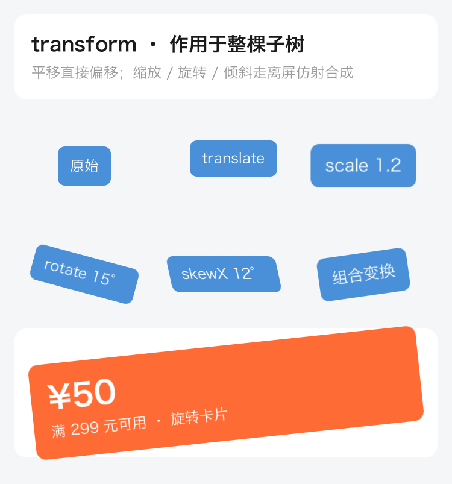<br/>**transform**（平移/缩放/旋转/倾斜） |
| 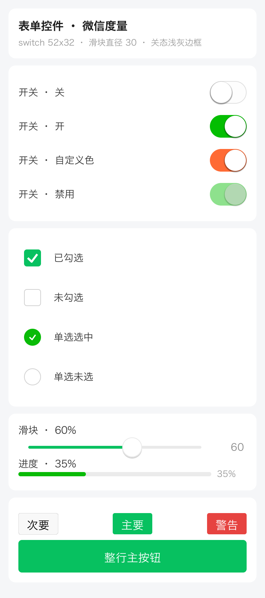<br/>**表单控件**（switch 各态/勾选/滑块） | <br/>**彩色 Emoji 混排** | |


---

## 🎬 视频与 Canvas

### 视频

`<video>` 组件自带 MP4 解复用（区分音/视频轨道）、H.264 解码（openh264）、音频解码与播放（symphonia + rodio，桌面端默认 macOS 音频接口）。支持 `autoplay` / `loop` / `muted` / `controls`。

```bash
cargo run --example video_player    # 独立播放窗口（自动循环，按刷新率出帧）
cargo run --example video_decode    # 离屏抓帧验证解码（输出 doc/videos/frame_*.png）
```

```html
<video src="doc/videos/video.mp4" autoplay="true" loop="true" controls="true" object-fit="cover" />
```

### Canvas 2D

`wx.createCanvasContext(id)` 返回完整的 2D 上下文，命令经桥接在 native 侧光栅化：

```javascript
const ctx = wx.createCanvasContext('demo');
ctx.setFillStyle('#07c160');
ctx.fillRect(20, 20, 120, 80);
ctx.beginPath();
ctx.arc(100, 200, 50, 0, 2 * Math.PI);
ctx.setStrokeStyle('#ff3b30'); ctx.setLineWidth(6); ctx.stroke();
ctx.setFontSize(24); ctx.setTextAlign('center'); ctx.fillText('Hello', 100, 300);
ctx.save(); ctx.translate(200, 200); ctx.rotate(0.6); ctx.fillRect(-40, -40, 80, 80); ctx.restore();
ctx.draw();
```

支持：`fillRect/strokeRect/clearRect`、`beginPath/moveTo/lineTo/arc/quadraticCurveTo/bezierCurveTo/rect/closePath`、`fill/stroke`、`fillText/strokeText`、`drawImage`、`setFillStyle/StrokeStyle/LineWidth/LineCap/LineJoin/FontSize/TextAlign/TextBaseline/GlobalAlpha`、`save/restore`、以及 `translate/rotate/scale` 完整仿射变换、线性/径向渐变。

后备缓冲按**设备分辨率**分配：元素逻辑尺寸 × 设备像素比，基础变换矩阵同步预乘这个比例，所以上面这些指令仍然用逻辑坐标下发，画出来是原生分辨率而不是放大的马赛克。元素真实尺寸只有布局后才知道，而 `ctx.draw()` 通常发生在 `onLoad` —— 因此指令流会被记下来，后备缓冲按实际尺寸重建后重放一遍。少了这一步，上下文只能用一个写死的默认尺寸，再被 1:1 拷进 2 倍分辨率的页面画布，内容就只落在元素左上角的四分之一里。

---

## 🧩 支持的组件

| 分类 | 组件 |
|------|------|
| 基础 | `view` `text` `image` `icon` `rich-text` |
| 表单 | `button` `input` `textarea` `checkbox` `checkbox-group` `radio` `radio-group` `switch` `slider` `progress` `picker` `picker-view` `picker-view-column` |
| 容器 | `scroll-view` `swiper` `swiper-item` |
| 媒体 | `video` `canvas` |

---

## 🎯 CSS 支持

- **选择器**：`view`、`.class`、`#id`、`*`、`.a.b`（复合）、`.a .b`（后代）、`.a > .b`（子）、`[type="primary"]` 属性选择器、伪类；按 (id, class, tag) 计算特异性并叠加书写顺序。
- **取值**：`rpx`/`px`/`%`/`vw`/`vh`/`em`/`rem`、`#rgb`/`#rrggbb`/`#rrggbbaa`/`rgb()`/`rgba()`/命名颜色/渐变、`var(--x, fallback)`、`calc(a + b)`（同单位）、`@import`。
- **布局**：`display` `flex-*` `justify-content` `align-*` `width/height/min/max` `padding/margin`（1–4 值简写、`auto` 居中）`position` `top/right/bottom/left` `gap`。
- **外观/文本/变换**：`background` `color` `border`（宽度精确、抗锯齿）`border-radius`（四角）`box-shadow` `opacity` `overflow`；`font-size` `font-weight` `text-align` `text-decoration` `line-height` `letter-spacing` `white-space` `text-overflow`；`transform`（translate/scale/rotate）`z-index`。
- **文本换行**：`display:block` / `width:100%` 的文本按容器宽度自动换行，盒子高度随行数增长（二次布局修正）。
- **简写 vs 细项**：级联把所有中选规则合并成一张表，简写与细项的先后关系在这一步就没了。落地时因此按固定档位排序（`border` 这类全能简写 → `border-color` 这类边/方向简写 → 细项），保证细项永远覆盖简写。

> 这里曾经藏着一个**渲染结果随机**的 bug：`.dot{border:2rpx solid #ccc}` 加 `.dot.on{border-color:#FF6B35}`，合并后表里同时有 `border` 和 `border-color`，而落地是按 HashMap 遍历顺序做的 —— Rust 每个进程一个随机 hash 种子，于是同一份源码**每次运行结果都可能不同**（地址页那个选中圆点时橙时灰）。修掉之后，固定动画时钟下 15 个页面的整帧快照跨进程逐字节稳定，这条也成了双端对比可信的前提。

---

## ♻️ 小程序生命周期

三级生命周期钩子均已接入（JS 注册 + Native 分发）：

| 层级 | 钩子 |
|------|------|
| **App** | `onLaunch` · `onShow` · `onHide` · `onError` · `onPageNotFound` · `onUnhandledRejection` · `onThemeChange` |
| **Page** | `onLoad` · `onShow` · `onReady` · `onHide` · `onUnload` · `onPullDownRefresh` · `onReachBottom` · `onPageScroll` · `onResize` · `onTabItemTap` · `onShareAppMessage` · `onShareTimeline` · `onAddToFavorites` |
| **Component** | `created` · `attached` · `ready` · `moved` · `detached`；`pageLifetimes`：`show` · `hide` · `resize` |

- 页面 `onShow/onHide/onResize` 会**联动**页面内组件的 `pageLifetimes`；
- 页面 `onUnload` 自动回收其组件实例并触发各组件 `detached`。

---

## 🏗️ 架构

```
┌─────────────────────────────────────────────────┐
│                    Mini App                       │
│  ┌──────────────────────────────────────────┐    │
│  │           JavaScript (QuickJS)            │    │
│  │  App · Page · Component · Behavior        │    │
│  │  require/module · Promise · setData 路径   │    │
│  └──────────────────────────────────────────┘    │
│                      ↕ Bridge                     │
│  ┌──────────────────────────────────────────┐    │
│  │              Native (Rust)                │    │
│  │  Canvas 渲染 · Taffy 布局 · 事件系统       │    │
│  │  WXML 解析 · WXSS 选择器引擎 · 模板引擎     │    │
│  └──────────────────────────────────────────┘    │
│                      ↕ FFI (mr_*)                 │
│  ┌──────────────────────────────────────────┐    │
│  │  Host: Android / iOS / Windows /          │    │
│  │        macOS / Linux / C / C++            │    │
│  └──────────────────────────────────────────┘    │
└─────────────────────────────────────────────────┘
```

模块按职责细分，便于扩展维护：`parser/`（wxml/wxss/expr/template）、`renderer/`（`wxml_renderer/` + `components/*` 每组件独立文件 + `style_parse` CSS 取值解析）、`layout/`、`js/`（runtime/api/bridge）、`ui/`（交互/滚动）、`runtime/`、`bin/`（各可执行程序）。

渲染器本身按单一职责拆成一组模块（原先是一个 3000 行的单文件，改动一处要在无关代码里翻半天）：

| 模块 | 职责 |
|------|------|
| `mod.rs` | 类型定义（事件绑定 / picker 登记 / 布局缓存）与渲染器构造 |
| `entry.rs` | 对外渲染入口：各入口只差「给不给交互上下文、给不给滚动偏移」 |
| `layout.rs` | 建树 + 样式解析 + flexbox 求解 + 换行高度修正 + 按数据指纹缓存 |
| `invalidate.rs` | `setData` 的增量失效：新旧树比对，算出只需重绘哪一块 |
| `draw.rs` | 视口裁剪、绘制分派，以及不带交互的绘制路径 |
| `draw_interactive.rs` | 页面主路径：边画边登记交互（顶层与子节点两个入口） |
| `animation.rs` | `@keyframes` / `transition` / `wx.createAnimation` 求值与 transform 合成、损伤区 |
| `pressed.rs` | 按压态（`:active` / `hover-class`）与 switch 拨动的进度与烘焙 |
| `fixed_layer.rs` | `position: fixed` 覆盖层（独立画布 + 视口坐标） |
| `hit_test.rs` | 事件绑定表、命中与冒泡（覆盖层与正常流分开）、picker 可点区域 |
| `interactions.rs` | 有内部状态的元素登记（勾选/开关/滑块/输入/滚动区/按压 view） |

拆分是**纯代码搬迁**，并且被验证过：拆分前后 15 个页面的整帧快照（固定动画时钟）逐字节相同。

---

## 🖌️ 素材图片生成

画廊中的商品图/Banner/头像等**真实照片**由火山引擎「豆包·文生图」生成，播放器/TabBar 图标由 PIL 以 4x 超采样绘制为**抗锯齿透明 PNG**：

```bash
python3 scripts/gen_assets.py
# -> doc/gallery/assets/*.jpg          （AI 生成的商品/封面/头像/Banner）
# -> doc/gallery/assets/icons/*.png    （PIL 绘制的透明矢量图标）
```

`<image>` 支持本地文件与网络 URL，`mode` 支持 `scaleToFill/aspectFit/aspectFill/widthFix` 等；透明 PNG 不会被套上不透明底框，仅在加载失败时回退占位符。

---

## 📦 多平台 SDK 编译

`crate-type = ["cdylib", "staticlib", "rlib"]`，可产出动态库(.so/.dylib/.dll)、静态库(.a)与 Rust 库。仓库 `scripts/` 提供各平台构建脚本。

| 平台 | 脚本 | 产物 |
|------|------|------|
| macOS | `scripts/build-macos.sh` | `libmini_render.dylib` / `.a`（arm64+x86_64 通用） |
| Linux | `scripts/build-linux.sh [target]` | `libmini_render.so` / `.a` |
| Windows | `scripts/build-windows.ps1` | `mini_render.dll` + 导入库 `.lib` |
| Android | `scripts/build-android.sh` | 4 个 ABI 的 `libmini_render.so`（jniLibs 结构） |
| iOS | `scripts/build-ios.sh` | `MiniRender.xcframework` |

> 移动端需先启用 rquickjs 的 `bindgen`（`*-apple-ios`/`*-linux-android` 无预置绑定，需 libclang），并将桌面端依赖（winit/softbuffer/rodio/openh264/arboard/ureq）改为可选特性、以 `--no-default-features` 构建精简核心库。详见脚本内注释。

重新生成 C 头文件：

```bash
cargo install cbindgen
bash scripts/gen-header.sh   # -> include/mini_render.h
```

---

## 💡 使用示例

### Rust — 渲染 WXML/WXSS 到图片

```rust
use mini_render::parser::{WxmlParser, WxssParser};
use mini_render::renderer::WxmlRenderer;
use mini_render::{Canvas, Color};
use serde_json::json;

fn main() {
    let wxml = WxmlParser::new(r#"<view class="card"><text class="t">{{title}}</text></view>"#).parse().unwrap();
    let ss = WxssParser::new(r#".card{padding:24rpx;background-color:#fff;border-radius:16rpx;} .t{font-size:34rpx;color:#333;}"#).parse().unwrap();
    let mut r = WxmlRenderer::new(ss, 375.0, 667.0);
    let mut canvas = Canvas::new(375, 667);
    canvas.clear(Color::from_hex(0xF5F5F5));
    r.render(&mut canvas, &wxml, &json!({ "title": "Hello Mini" }));
    canvas.save_png("out.png").unwrap();
}
```

### Rust — 驱动小程序逻辑层

```rust
use mini_render::runtime::MiniApp;

fn main() -> Result<(), String> {
    let mut app = MiniApp::new(375, 667)?;
    app.init()?;
    app.define_module("utils/util", "exports.double = x => x * 2;")?;
    app.load_script(r#"
        const util = require('utils/util');
        Page({ data: { count: 0 }, inc() { this.setData({ count: util.double(this.data.count + 1) }); } });
    "#)?;
    app.eval("__currentPage.inc()")?;
    println!("data = {}", app.eval("__getPageData()")?); // {"count":2}
    Ok(())
}
```

### C / C++ — 通过 FFI 使用 2D 渲染

```c
#include "mini_render.h"
int main(void) {
    Canvas* c = mr_canvas_new(375, 667);
    mr_canvas_clear(c, 245, 245, 245, 255);
    mr_canvas_draw_circle(c, 70, 80, 30, 74, 144, 217, 255, 0, 0);
    mr_canvas_save_png(c, "card.png");
    mr_canvas_free(c);
    return 0;
}
```

```bash
cargo build --release
clang examples/demo.c -Iinclude -Ltarget/release -lmini_render -o demo_c
DYLD_LIBRARY_PATH=target/release ./demo_c
```

### Android / iOS

`libmini_render.so` / `MiniRender.xcframework` 暴露 C 接口，在 NDK / Swift 侧渲染后把 RGBA 拷入 `Bitmap` / `CGContext`：

```c
Canvas* c = mr_canvas_new(w, h);
mr_canvas_clear(c, 255, 255, 255, 255);
size_t need = (size_t)w * h * 4; uint8_t* buf = malloc(need);
mr_canvas_get_pixels(c, buf, need);   // RGBA8888 -> AndroidBitmap / UIImage
free(buf); mr_canvas_free(c);
```

---

## 🧪 测试

覆盖表达式引擎、WXSS 选择器（含 `var()`/`calc()`）、模板控制流、布局与文本换行、全组件渲染、Canvas 2D、交互、滚动/惯性、页面栈路由、组件模型、CommonJS 模块、Promise、生命周期、事件冒泡等：

```bash
cargo test          # 223 个用例
cargo test route    # 路由/页面栈/组件/模块/异步/生命周期
cargo test canvas   # Canvas 2D 上下文与命令
cargo test scroll   # 滚动与惯性
```

---

## 📁 项目结构

```
mini-render/
├── src/
│   ├── canvas.rs / color.rs / geometry.rs / paint.rs / path.rs / text.rs
│   ├── ffi.rs                  # C FFI (mr_*)
│   ├── event.rs                # 事件系统
│   ├── bin/                    # mini-app / mini-app-window / mini-launcher / mini-devserver
│   ├── js/                     # QuickJS runtime / api（App/Page/Component）/ bridge
│   ├── parser/                 # wxml / wxss（选择器引擎）/ expr / template
│   ├── renderer/               # wxml_renderer/*（布局/绘制/动画/命中/覆盖层）+ components/*
│   ├── ui/                     # interaction / scroll_controller / scroll_cache
│   ├── runtime/                # MiniApp 应用运行时
│   └── tests/                  # 单元/集成测试
├── examples/                   # gallery / video_player / video_decode / demo
├── scripts/                    # 各平台 SDK 构建脚本 + gen_assets.py 素材生成
├── assets/                     # 字体资源
├── include/mini_render.h       # C 头文件
├── doc/                        # 文档、画廊图片、视频素材
└── sample-app/                 # 示例小程序
```

---

## 📄 License

MIT

[Taffy]: https://github.com/DioxusLabs/taffy
