# Mini Render

一个用 Rust 实现的轻量级微信小程序渲染引擎。内置 2D 渲染、Flexbox 布局、WXML/WXSS 解析、完整 CSS 选择器引擎、`{{ }}` 表达式引擎，以及基于 QuickJS 的 JavaScript 运行时（App / Page / Component / 模块系统 / Promise），并向 Skyline 的实现对齐。

> 纯 Rust，无系统渲染依赖；核心库可编译为 **Android / iOS / Windows / macOS / Linux** 的原生库供各端集成。

## ✨ 特性

- 🎨 **2D 渲染引擎** — 纯 Rust 实现，抗锯齿、Alpha 混合、圆角、阴影、渐变
- ⚡ **QuickJS 脚本引擎** — 完整 JS 运行时，支持 Promise / async-await 微任务泵
- 🧩 **26+ 内置组件** — view/text/button/input/scroll-view/swiper/canvas 等
- 📐 **Flexbox 布局** — 基于 Taffy 的完整 Flexbox
- 🎯 **完整 CSS 选择器引擎** — 标签 / 类 / `#id` / `*` / 属性 `[attr]` / 组合器（后代、子 `>`、兄弟）/ 正确的特异性 / `@import` / `var()` / `calc()`
- 📄 **WXML 模板** — `wx:if/elif/else`、`wx:for`、`<block>`、真正的 `{{ }}` 表达式（算术/逻辑/三元/成员/索引/字面量）
- 🔀 **逻辑层运行时** — 页面栈路由、`setData` 数据路径、自定义组件 + Behavior、CommonJS 模块
- 👆 **事件系统** — `bindtap` 冒泡、`catchtap` 阻止冒泡、`dataset`
- 🖱️ **交互** — 滚动惯性/回弹、输入框、勾选/单选/开关/滑块
- 🔗 **C FFI** — 可嵌入 C/C++/移动端/桌面端

## 📸 运行效果

由内置示例小程序渲染的首页（`cargo run --bin mini-app` 输出）：


## 🖼️ 场景画廊

以下页面均由本引擎真实渲染输出（纯 WXML + WXSS + 数据），一键生成：

```bash
cargo run --example gallery   # 渲染全部场景到 doc/gallery/
```

### 电商 · 社交 · 导航

| | | |
|:---:|:---:|:---:|
| <br/>**登录页** | <br/>**商品列表** | 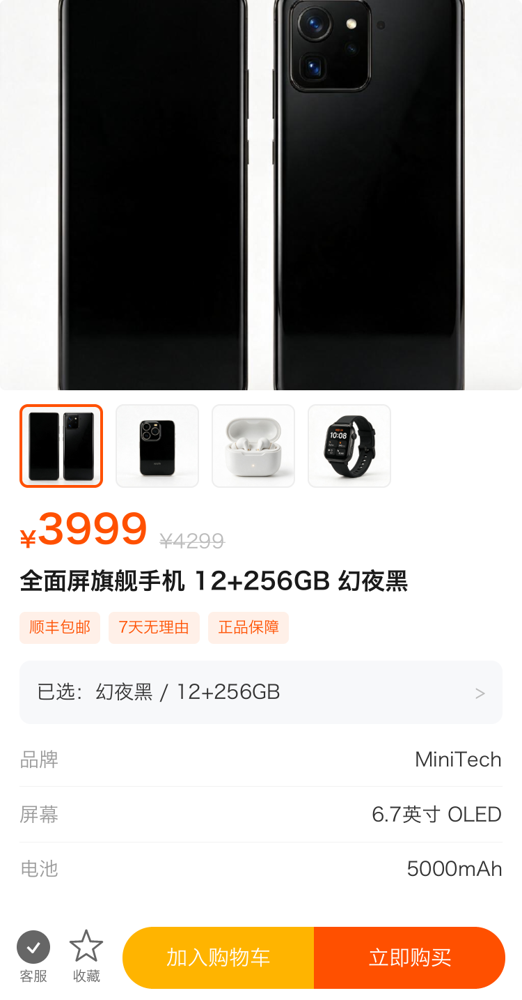<br/>**商品详情** |
| 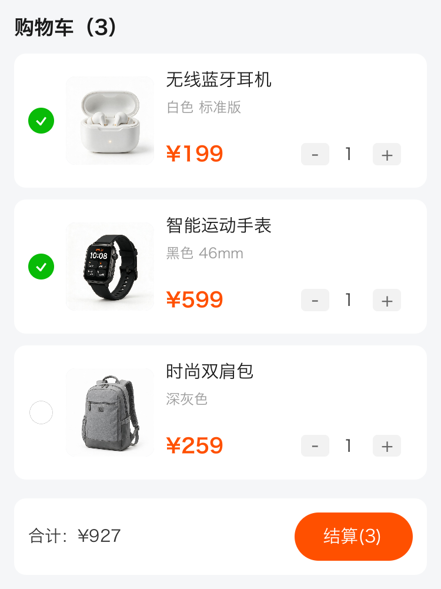<br/>**购物车** | <br/>**个人中心** | 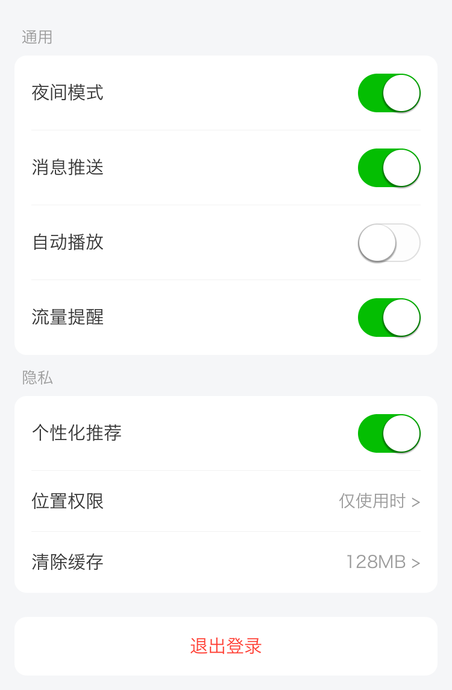<br/>**设置页** |
| <br/>**聊天对话** | <br/>**动态流** | 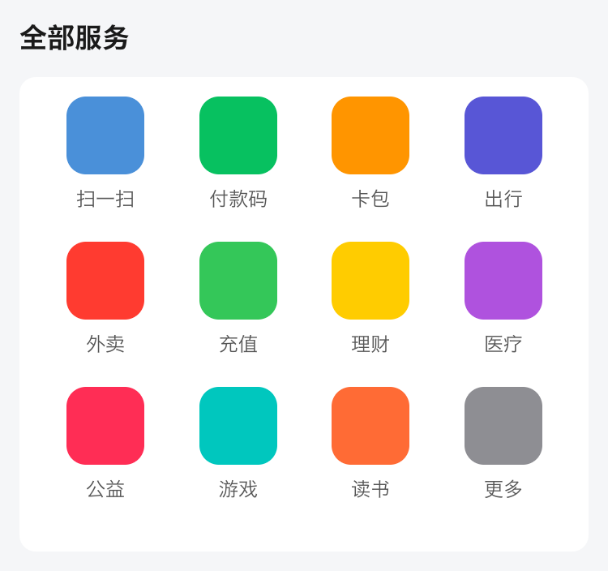<br/>**宫格导航** |

### 表单 · 数据 · 生活

| | | |
|:---:|:---:|:---:|
| 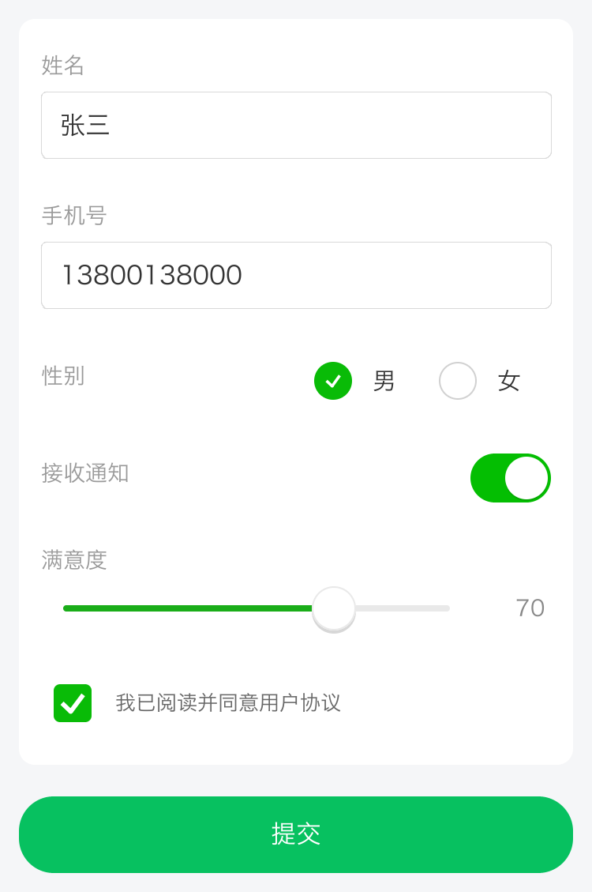<br/>**表单填写** | 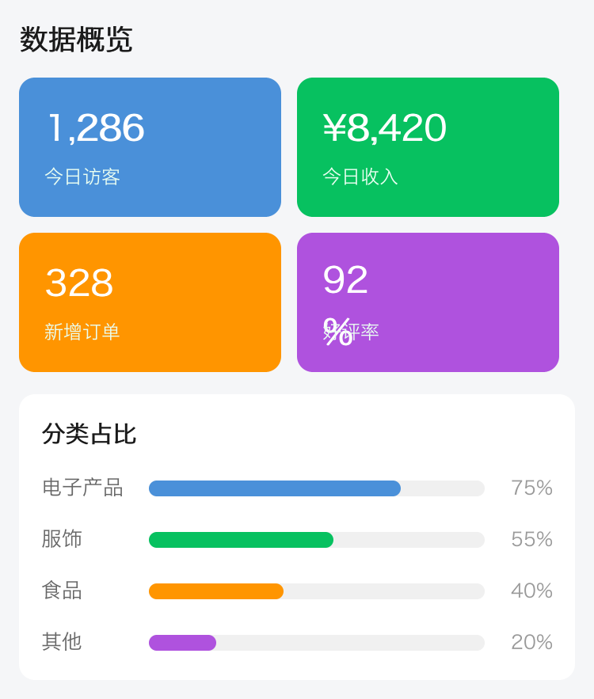<br/>**数据看板** | 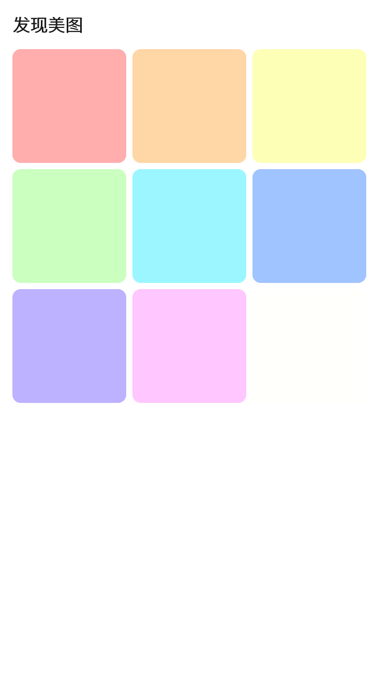<br/>**图片画廊** |
| 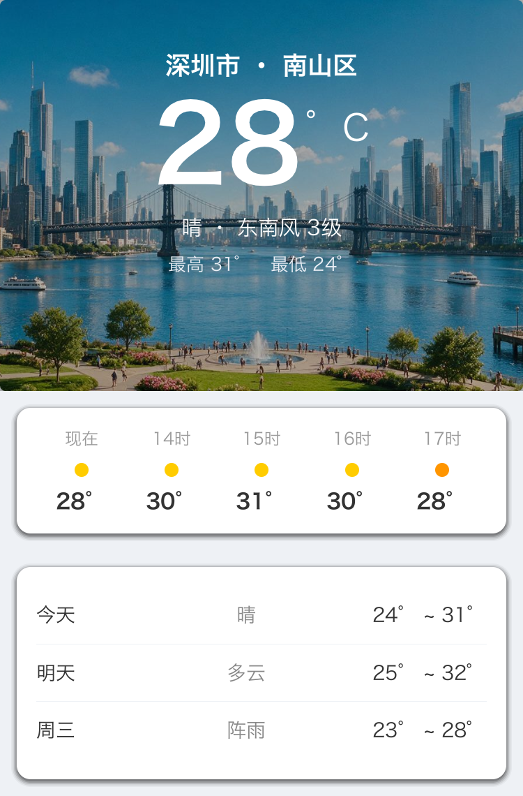<br/>**天气** | 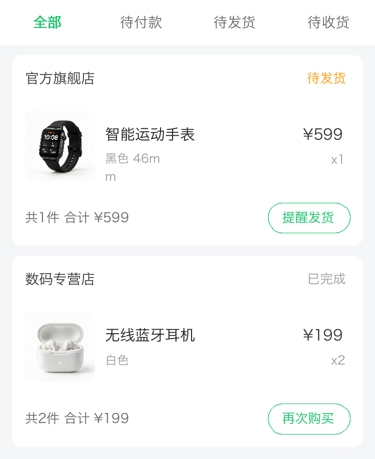<br/>**订单列表** | 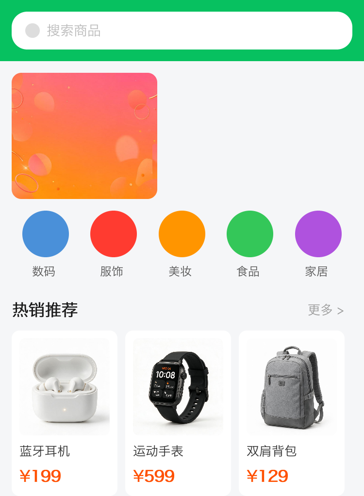<br/>**商城首页** |
| 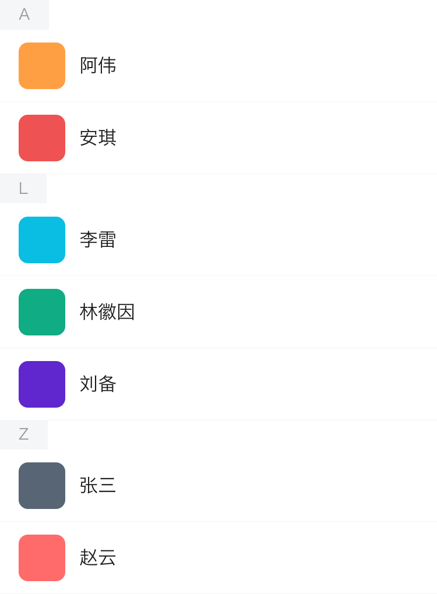<br/>**通讯录** | <br/>**音乐播放器** | 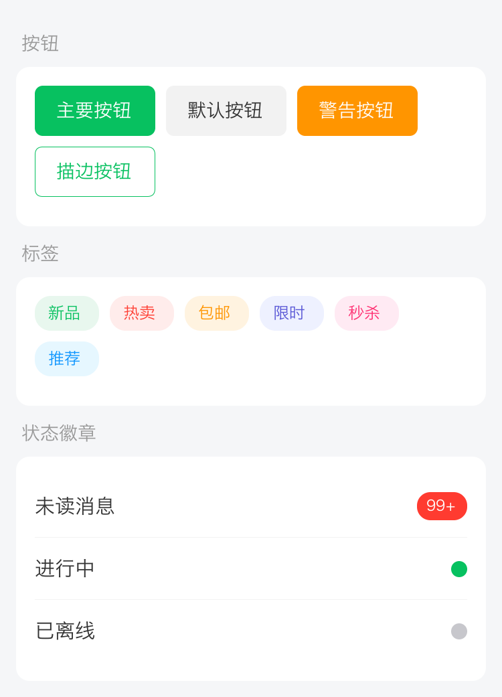<br/>**标签与徽章** |

> 这些页面覆盖了卡片、列表、宫格、Flex 布局、圆角/阴影、渐变色、进度条、开关/滑块/单选框、气泡、徽章、头像等常见 UI 模式，全部通过 `wx:for` / `{{ }}` 数据绑定驱动。

### 弹窗 · 滑动 · 交互

| | | |
|:---:|:---:|:---:|
| <br/>**确认弹窗** | <br/>**操作面板** | <br/>**Toast 提示** |
| <br/>**Swiper 轮播** | <br/>**左右滑动** | 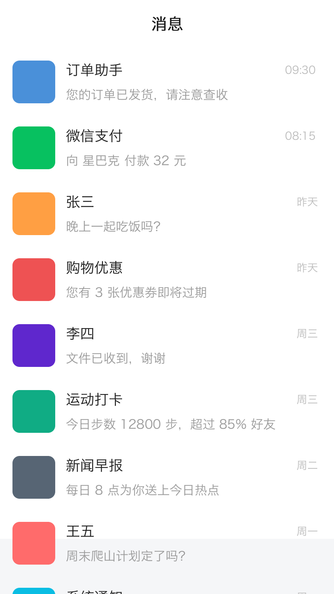<br/>**上下滑动** |
| <br/>**底部选择器** | <br/>**日历** | 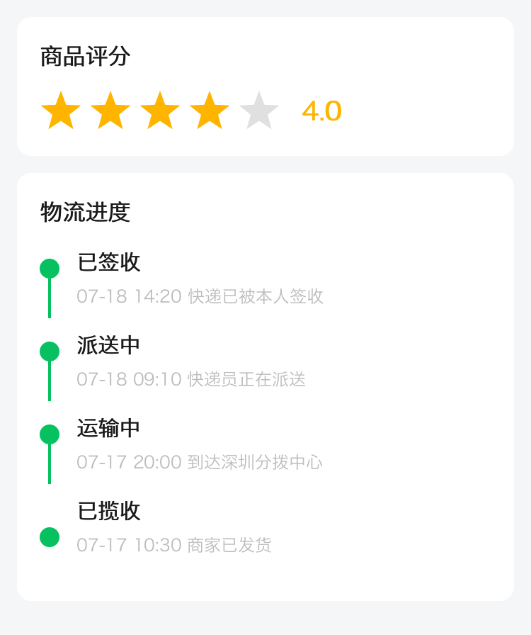<br/>**评分与物流** |

> 弹窗类通过半透明遮罩 + 居中/底部面板实现；`swiper` 轮播、`scroll-view` 的横向/纵向滚动均为组件真实渲染；星级评分使用 `icon` 的 `star` 类型（路径绘制）。

## 🏗️ 架构

```
┌─────────────────────────────────────────────────┐
│                  Mini App                        │
│  ┌──────────────────────────────────────────┐   │
│  │              JavaScript (QuickJS)         │   │
│  │  App · Page · Component · Behavior        │   │
│  │  require/module · Promise · setData 路径   │   │
│  └──────────────────────────────────────────┘   │
│                      ↕ Bridge                    │
│  ┌──────────────────────────────────────────┐   │
│  │              Native (Rust)                │   │
│  │  Canvas 渲染 · Taffy 布局 · 事件系统       │   │
│  │  WXML 解析 · WXSS 选择器引擎 · 模板引擎     │   │
│  └──────────────────────────────────────────┘   │
│                      ↕ FFI (mr_*)                │
│  ┌──────────────────────────────────────────┐   │
│  │   Host: Android / iOS / Windows / macOS / │   │
│  │         Linux / C / C++                    │   │
│  └──────────────────────────────────────────┘   │
└─────────────────────────────────────────────────┘
```

## 🧩 支持的组件

| 分类 | 组件 |
|------|------|
| 基础 | `view` `text` `image` `icon` `rich-text` |
| 表单 | `button` `input` `textarea` `checkbox` `checkbox-group` `radio` `radio-group` `switch` `slider` `progress` `picker` `picker-view` `picker-view-column` |
| 容器 | `scroll-view` `swiper` `swiper-item` |
| 媒体 | `video` `canvas` |

## 🎯 CSS 支持

**选择器**：`view`、`.class`、`#id`、`*`、`.a.b`（复合）、`.a .b`（后代）、`.a > .b`（子）、`[type="primary"]` 等属性选择器、伪类；按 (id, class, tag) 计算特异性并叠加书写顺序。

**取值**：`rpx`/`px`/`%`/`vw`/`vh`/`em`/`rem`、`#rgb`/`#rrggbb`/`#rrggbbaa`/`rgb()`/`rgba()`/命名颜色/渐变、`var(--x, fallback)`、`calc(a + b)`（同单位）、`@import`。

**布局**：`display` `flex-*` `justify-content` `align-*` `width/height/min/max` `padding/margin`（1–4 值简写）`position` `top/right/bottom/left` `gap`。

**外观/文本/变换**：`background` `color` `border` `border-radius`（四角）`box-shadow` `opacity` `overflow`；`font-size` `font-weight` `text-align` `text-decoration` `line-height` `letter-spacing` `white-space` `text-overflow`；`transform`（translate/scale/rotate）`z-index`。

## 📄 WXML / WXSS / JS 语法

```html
<!-- 数据绑定 + 表达式 -->
<view>{{ user.name }} 共 {{ list.length }} 项，{{ vip ? '会员' : '普通' }}</view>

<!-- 列表 / 条件 / block -->
<block wx:for="{{items}}" wx:key="id">
  <view wx:if="{{item.stock > 0}}">{{item.title}} ¥{{item.price}}</view>
  <view wx:else>已售罄</view>
</block>

<!-- 事件（冒泡 / 阻止冒泡） -->
<view bindtap="onOuter">
  <button catchtap="onBuy" data-id="{{id}}">购买</button>
</view>
```

```css
.card { padding: 20rpx; border-radius: 16rpx; box-shadow: 0 4rpx 12rpx rgba(0,0,0,.1); }
.list .item { color: var(--fg, #333); }          /* 后代选择器 + CSS 变量 */
.bar { width: calc(100rpx + 20rpx); }             /* calc 同单位 */
```

```javascript
Page({
  data: { count: 0, list: [] },
  onLoad() { this.setData({ 'list[0].done': true }); },   // 数据路径
  inc() { this.setData({ count: this.data.count + 1 }); },
})
```

## 🚀 快速开始

```bash
# 1) 安装 Rust
curl --proto '=https' --tlsv1.2 -sSf https://sh.rustup.rs | sh

# 2) 构建
cargo build --release

# 3) 运行示例
cargo run --bin mini-app          # 无窗口渲染示例小程序首页 -> mini_app_ui.png
cargo run --bin mini-launcher     # 小程序启动器（扫描 sample 目录加载）
cargo run --bin mini-app-window   # 窗口应用
cargo run --example demo          # 2D 渲染示例

# 4) 测试（192 个用例）
cargo test
```

## 📦 编译为各平台 SDK

`crate-type = ["cdylib", "staticlib", "rlib"]`，可产出动态库(.so/.dylib/.dll)、静态库(.a)与 Rust 库。仓库 `scripts/` 下提供了各平台构建脚本。

| 平台 | 脚本 | 产物 |
|------|------|------|
| macOS | `scripts/build-macos.sh` | `libmini_render.dylib` / `.a`（arm64+x86_64 通用） |
| Linux | `scripts/build-linux.sh [target]` | `libmini_render.so` / `.a` |
| Windows | `scripts/build-windows.ps1` | `mini_render.dll` + 导入库 `.lib` |
| Android | `scripts/build-android.sh` | 4 个 ABI 的 `libmini_render.so`（jniLibs 结构） |
| iOS | `scripts/build-ios.sh` | `MiniRender.xcframework` |

### 桌面端（开箱即用）

```bash
# macOS 通用库（已验证：lipo 输出 x86_64 arm64）
bash scripts/build-macos.sh

# Linux（在 Linux 主机执行；可传目标三元组）
bash scripts/build-linux.sh                       # 当前架构
bash scripts/build-linux.sh aarch64-unknown-linux-gnu

# Windows（在 Windows 主机 + MSVC 执行）
pwsh scripts/build-windows.ps1
```

### 移动端精简构建（Android / iOS）⚠️

核心渲染/解析/JS 库是可移植的，但**默认构建捆绑了桌面端专用依赖**（窗口 `winit`/`softbuffer`、音频 `rodio`、视频 `openh264`、剪贴板 `arboard`、网络 `ureq`），这些依赖无法直接交叉编译到移动端。生成移动端 SDK 需要两步准备：

1. **启用 rquickjs 的 bindgen**：`rquickjs-sys` 对 `*-apple-ios`、`*-linux-android` 等目标没有预置绑定，需要在运行期生成。在 `Cargo.toml` 为 rquickjs 打开 `bindgen`（或 `bindgen-runtime`）特性（需系统安装 libclang）。
2. **裁剪桌面依赖**：把上述桌面端依赖改为可选（cargo `features`），并对使用处 `#[cfg(...)]` 门控，移动端以 `--no-default-features` 构建仅含核心渲染与 FFI 的精简库。

完成上述准备后：

```bash
# Android（需 Android NDK + cargo-ndk）
cargo install cargo-ndk
rustup target add aarch64-linux-android armv7-linux-androideabi \
                  x86_64-linux-android i686-linux-android
bash scripts/build-android.sh
# -> target/android/jniLibs/{arm64-v8a,armeabi-v7a,x86_64,x86}/libmini_render.so

# iOS（需 Xcode）
rustup target add aarch64-apple-ios aarch64-apple-ios-sim x86_64-apple-ios
bash scripts/build-ios.sh
# -> target/ios/MiniRender.xcframework
```

### 重新生成 C 头文件

```bash
cargo install cbindgen
bash scripts/gen-header.sh   # -> include/mini_render.h
```

## 💡 使用示例

### 1) Rust — 渲染 WXML/WXSS 到图片

```rust
use mini_render::parser::{WxmlParser, WxssParser};
use mini_render::renderer::WxmlRenderer;
use mini_render::{Canvas, Color};
use serde_json::json;

fn main() {
    let wxml = WxmlParser::new(
        r#"<view class="card"><text class="title">{{title}}</text></view>"#
    ).parse().unwrap();

    let ss = WxssParser::new(
        r#".card{padding:24rpx;background-color:#fff;border-radius:16rpx;}
           .title{font-size:34rpx;color:#333;}"#
    ).parse().unwrap();

    let mut renderer = WxmlRenderer::new(ss, 375.0, 667.0);
    let mut canvas = Canvas::new(375, 667);
    canvas.clear(Color::from_hex(0xF5F5F5));
    renderer.render(&mut canvas, &wxml, &json!({ "title": "Hello Mini" }));
    canvas.save_png("out.png").unwrap();
}
```

### 2) Rust — 驱动完整小程序逻辑层

```rust
use mini_render::runtime::MiniApp;

fn main() -> Result<(), String> {
    let mut app = MiniApp::new(375, 667)?;
    app.init()?;

    // 多文件依赖
    app.define_module("utils/util", "exports.double = x => x * 2;")?;
    app.load_script(r#"
        const util = require('utils/util');
        Page({
            data: { count: 0 },
            inc() { this.setData({ count: util.double(this.data.count + 1) }); }
        });
    "#)?;

    app.eval("__currentPage.inc()")?;
    println!("data = {}", app.eval("__getPageData()")?); // {"count":2}

    // 页面栈路由
    app.load_script(r#"Page({ data: { name: "详情页" } });"#)?; // navigateTo 入栈
    println!("stack = {}", app.eval("getCurrentPages().length")?); // 2
    app.eval("wx.navigateBack()")?;                                 // 出栈
    Ok(())
}
```

### 3) C / C++ — 通过 FFI 使用 2D 渲染

```c
#include "mini_render.h"

int main(void) {
    Canvas* canvas = mr_canvas_new(375, 667);
    mr_canvas_clear(canvas, 245, 245, 245, 255);

    // 卡片（圆角矩形用 path）
    Path* card = mr_path_new();
    mr_path_add_round_rect(card, 20, 20, 335, 120, 16);
    mr_canvas_draw_path(canvas, card, 255, 255, 255, 255, 0, 0); // 填充白色
    mr_path_free(card);

    // 圆形头像
    mr_canvas_draw_circle(canvas, 70, 80, 30, 74, 144, 217, 255, 0, 0);

    mr_canvas_save_png(canvas, "card.png");
    mr_canvas_free(canvas);
    return 0;
}
```

编译链接（macOS）：

```bash
cargo build --release
clang examples/demo.c -Iinclude -Ltarget/release -lmini_render -o demo_c
DYLD_LIBRARY_PATH=target/release ./demo_c
```

### 4) Android — 获取像素填充 Bitmap（NDK / C 侧）

`libmini_render.so` 暴露 C 接口。在 NDK C 代码中渲染并把 RGBA 拷回 `Bitmap`：

```c
// 渲染并将像素写入 Android Bitmap 的像素缓冲
Canvas* c = mr_canvas_new(w, h);
mr_canvas_clear(c, 255, 255, 255, 255);
mr_canvas_draw_rect(c, 10, 10, 100, 50, 74, 144, 217, 255, 0, 0);

size_t need = (size_t)w * h * 4;
uint8_t* buf = malloc(need);
mr_canvas_get_pixels(c, buf, need);   // RGBA8888
// AndroidBitmap_lockPixels 后 memcpy(pixels, buf, need)
free(buf);
mr_canvas_free(c);
```

> Java/Kotlin 侧通过一个薄 JNI 包装（`JNIEXPORT` 函数内部调用 `mr_*`）即可调用；`build-android.sh` 产出的 `jniLibs` 放入 `src/main/jniLibs`。

### 5) iOS — Swift 调用 XCFramework

将 `MiniRender.xcframework` 拖入工程，桥接头 `#import "mini_render.h"`：

```swift
let canvas = mr_canvas_new(375, 667)
mr_canvas_clear(canvas, 245, 245, 245, 255)
mr_canvas_draw_circle(canvas, 100, 100, 40, 231, 76, 60, 255, 0, 0)

let w = 375, h = 667, len = w * h * 4
var buf = [UInt8](repeating: 0, count: len)
mr_canvas_get_pixels(canvas, &buf, len)   // 填入 CGContext / UIImage
mr_canvas_free(canvas)
```

## 🧪 测试

覆盖表达式引擎、WXSS 选择器（含 `var()`/`calc()`）、模板控制流、布局、全组件渲染、交互、滚动/惯性/回弹、页面栈路由、组件模型、CommonJS 模块、Promise、事件冒泡等：

```bash
cargo test          # 192 个用例
cargo test route    # 路由/页面栈/组件/模块/异步
cargo test scroll   # 滚动与惯性
cargo test event    # 事件冒泡/catch
```

## 📁 项目结构

```
mini-render/
├── src/
│   ├── lib.rs / canvas.rs / color.rs / geometry.rs / paint.rs / path.rs / text.rs
│   ├── ffi.rs                  # C FFI (mr_*)
│   ├── event.rs                # 事件系统
│   ├── bin/                    # mini-app / mini-app-window / mini-launcher
│   ├── js/                     # QuickJS runtime / api（App/Page/Component/模块）/ bridge
│   ├── parser/                 # wxml / wxss（选择器引擎）/ expr（表达式）/ template
│   ├── renderer/               # wxml_renderer / vdom_diff / components/*
│   ├── ui/                     # interaction / scroll_controller / scroll_cache
│   ├── runtime/                # MiniApp 应用运行时
│   └── tests/                  # 单元/集成测试
├── scripts/                    # 各平台 SDK 构建脚本
├── assets/                     # 字体资源
├── include/mini_render.h       # C 头文件
├── examples/                   # demo.rs / demo.c / mini_app_window.rs
├── doc/                        # 文档与效果图
└── sample-app/                 # 示例小程序（index/category/cart/... ）
```

## 📋 依赖

[Taffy](https://github.com/DioxusLabs/taffy)（布局）· [rquickjs](https://github.com/DelSkayn/rquickjs)（JS）· [winit](https://github.com/rust-windowing/winit) + [softbuffer](https://github.com/rust-windowing/softbuffer)（窗口，桌面）· [image](https://github.com/image-rs/image) · [fontdue](https://github.com/mooman219/fontdue)（字体）· rodio/symphonia（音频）· openh264（视频）

## 📄 License

MIT
