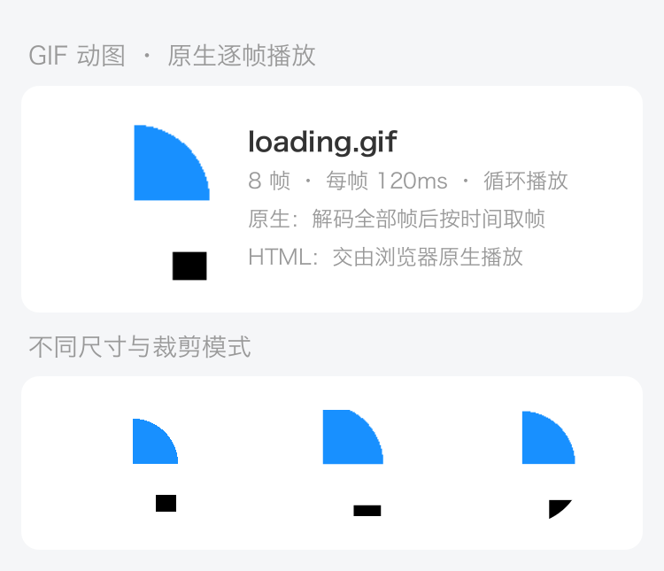
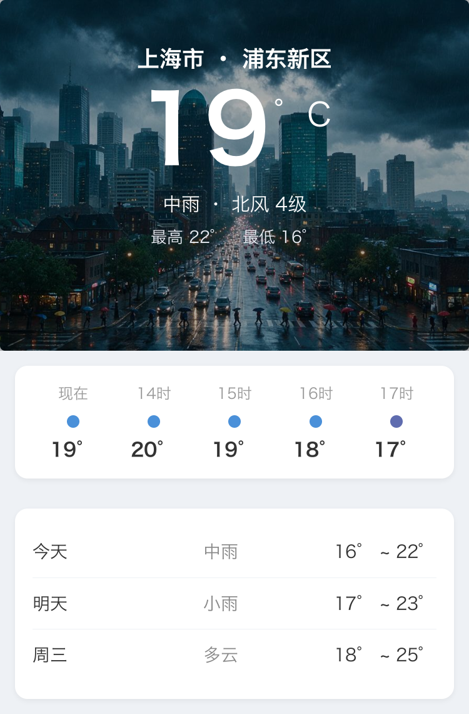
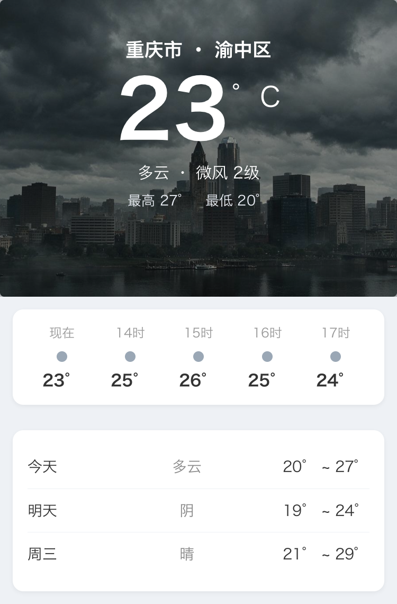
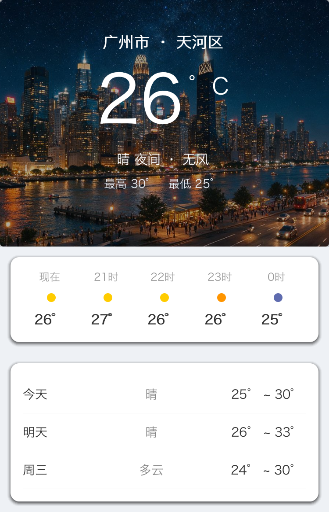
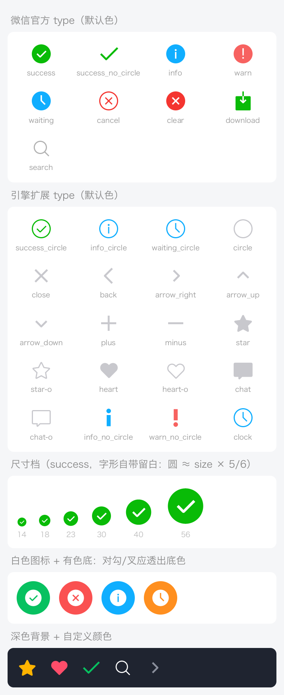

# 场景画廊（65 张真实渲染）

下面每一张都是本引擎真实渲染的输出（纯 WXML + WXSS + 数据，无 WebView、无系统控件），
`375×667 @2x` 出图。它们同时是**回归基线**：固定动画时钟下逐字节可复现，改动前后
`python3 tools/pixdiff.py` 比一遍就知道有没有画坏。

```bash
python3 scripts/gen_assets.py            # 首次：生成真实商品图/头像/图标素材
cargo run --release --example gallery     # 渲染 65 张场景到 doc/gallery/
```

> 场景代码按主题拆在 `examples/gallery_parts/` 下（`common.rs` 提供 `render`，其余按主题分文件），
> 由 `examples/gallery.rs` 用 `include!` 组合。
>
> 文件名前缀只是**历史生成顺序**，不连续也不唯一：`52~57`、`62~64` 空缺，
> `35/36/37` 被天气与 GIF/资讯两批共用。判断范围以 `examples/gallery.rs` 的调用顺序为准。

---

## 电商 · 社交 · 导航

| | | |
|:---:|:---:|:---:|
| <br/>**登录页** | <br/>**商品列表** | <br/>**商品详情** |
| <br/>**购物车** | <br/>**个人中心** | <br/>**设置页** |
| <br/>**聊天对话** | <br/>**动态流** | <br/>**宫格导航** |

## 表单 · 数据 · 生活

| | | |
|:---:|:---:|:---:|
| <br/>**表单填写** | <br/>**数据看板** | <br/>**图片画廊** |
| <br/>**天气**（晴 · 深圳） | <br/>**订单列表** | <br/>**商城首页** |
| <br/>**通讯录** | <br/>**音乐播放器** | <br/>**标签与徽章** |

## 弹窗 · 滑动 · 交互

| | | |
|:---:|:---:|:---:|
| <br/>**确认弹窗** | <br/>**操作面板** | <br/>**Toast 提示** |
| <br/>**Swiper 轮播** | <br/>**左右滑动** | <br/>**上下滑动** |
| <br/>**底部选择器** | <br/>**日历** | <br/>**评分与物流** |

## 电商大促 · 组件补充

| | | |
|:---:|:---:|:---:|
| <br/>**电商首页**（轮播/秒杀/瀑布流） | <br/>**优惠券弹窗** | <br/>**底部 TabBar** |
| <br/>**自定义搜索栏** | <br/>**输入与事件** | <br/>**视频播放器** |
| <br/>**Canvas 2D 绘图** | <br/>**GIF 动图** 第 1 帧 | <br/>**GIF 动图** 第 4 帧 |

`35_gif_frame1~4` 是同一张 GIF 的连续四帧，用来证明逐帧解码与推进是稳定的。

## 多城市天气（同一份模板 × 不同数据与背景）

| | | |
|:---:|:---:|:---:|
| <br/>**中雨 · 上海** | <br/>**多云 · 重庆** | <br/>**晴夜 · 广州** |

## 资讯类（与 `news-app` 示例同款设计）

| | | |
|:---:|:---:|:---:|
| <br/>**新闻信息流**（频道横滑/热榜） | <br/>**文章详情**（长文/评论） | <br/>**视频频道** |
| <br/>**我的**（开关/滑块设置） | | |

## 更多商业场景

| | | |
|:---:|:---:|:---:|
| <br/>**物流跟踪**（时间轴） | <br/>**直播带货** | <br/>**外卖点餐**（左右分栏） |
| <br/>**会员中心** | <br/>**支付收银台** | <br/>**评价晒单** |
| <br/>**搜索结果** | <br/>**消息中心** | <br/>**签到打卡** |
| <br/>**行情看板** | <br/>**酒店预订** | <br/>**运动健康** |

## CSS 动画 · 变换 · 控件度量

`58_css_anim_frame1~4` 是同一份 WXML/WXSS 在 `t = 0 / 0.3 / 0.6 / 0.9s` 的四张快照 ——
固定动画时钟就能把 `@keyframes` 的任意一帧稳定截出来，因此**动画也能进回归对比**。

| | | |
|:---:|:---:|:---:|
| <br/>**CSS 动画 t=0s** | <br/>**CSS 动画 t=0.6s**（旋转/脉冲/弹跳） | <br/>**transform**（平移/缩放/旋转/倾斜） |
| <br/>**表单控件**（switch 各态/勾选/滑块） | <br/>**彩色 Emoji 混排** | <br/>**内置图标总览**（`<icon>` 基线） |

`65_icon_showcase` 是 `<icon>` 的回归基线：WeUI 官方九种 type + 扩展图标 + 着色/尺寸各档
一次画全。图标用的是矢量路径数据，不是位图 —— `success` 是实心圆挖出对勾形的洞。

---

## 素材是怎么来的

商品图 / Banner / 头像等**真实照片**由火山引擎「豆包·文生图」生成；播放器与 TabBar 图标由
PIL 以 4x 超采样绘制成**抗锯齿透明 PNG**：

```bash
python3 scripts/gen_assets.py
# -> doc/gallery/assets/*.jpg          （AI 生成的商品/封面/头像/Banner）
# -> doc/gallery/assets/icons/*.png    （PIL 绘制的透明矢量图标）
```

`<image>` 支持本地文件与网络 URL，`mode` 支持 `scaleToFill / aspectFit / aspectFill / widthFix` 等；
透明 PNG 不会被套上不透明底框，仅在加载失败时回退占位符。

## 相关文档

- [架构与实现原理](架构与实现原理.md) —— 一帧是怎么画出来的、帧成本怎么压下来
- [示例与调试](示例与调试.md) —— 示例小程序、无头快照、双端对比、浏览器预览
- [踩坑记录](踩坑记录.md) —— 这些图曾经画错成什么样，以及为什么
